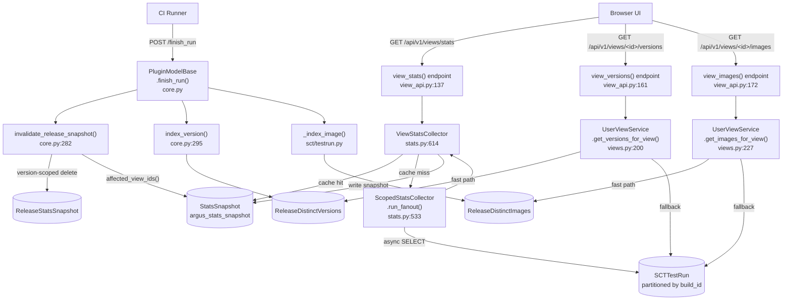
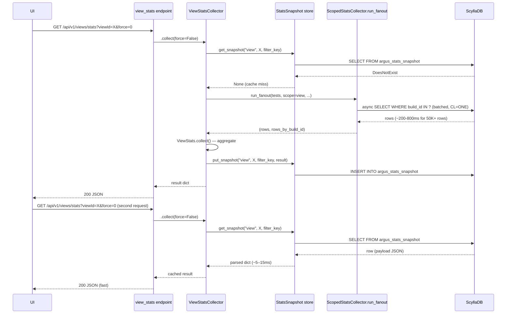
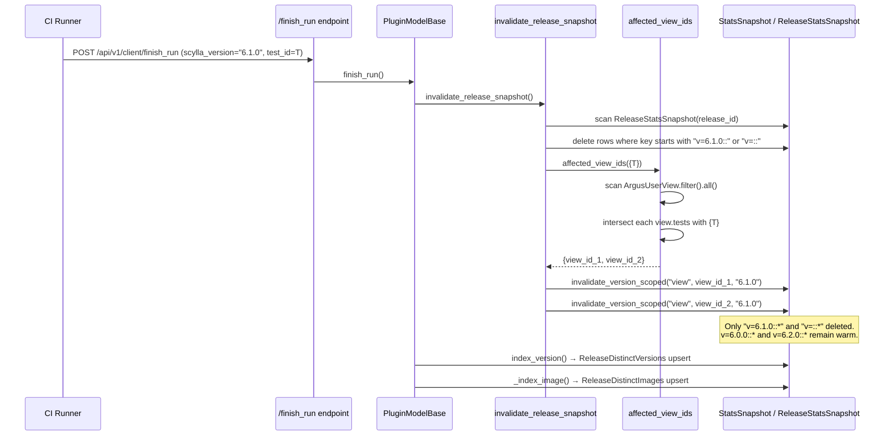
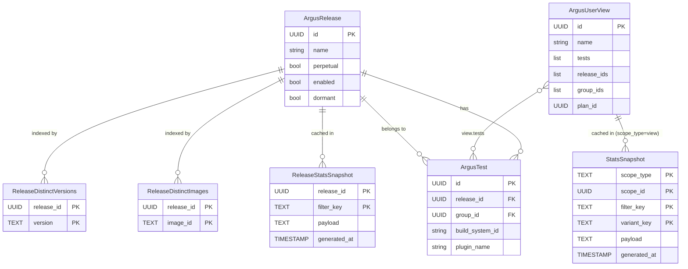

# Dashboard View Cache Architecture

This document describes the unified caching model for Argus release and view stats endpoints,
covering reads, writes, and invalidation. It is the authoritative reference for
`argus/backend/service/stats_snapshot.py` and the `StatsSnapshot` table.

Cross-references:
- [Performance optimization plan](../plans/dashboard-performance-optimization.md) — release stats background
- [View unification plan](../plans/dashboard-view-unification.md) — full Phase A/B roadmap

---

## Two Scopes, One Store

Both the release dashboard (`GET /api/v1/release/stats/v2`) and the view dashboard
(`GET /api/v1/views/stats`) render the same test-grid UI, but historically ran on
divergent backend paths:

| Scope   | Before Phase A                   | After Phase A                         |
|---------|----------------------------------|---------------------------------------|
| Release | `ReleaseStatsSnapshot` table     | `ReleaseStatsSnapshot` (unchanged)    |
| View    | No cache — full recompute always | `StatsSnapshot(scope_type="view")`    |

Phase B (B4) will migrate the release scope into `StatsSnapshot` as well.

### `StatsSnapshot` table schema

```
argus_stats_snapshot
  scope_type   TEXT   partition_key    — "release" | "view"
  scope_id     UUID   partition_key    — release_id or view_id
  filter_key   TEXT   clustering key   — encodes version/image/nov/lim filter
  variant_key  TEXT   clustering key   — "" (whole-scope) | "widget:<position>"
  payload      TEXT                    — JSON blob (ArgusJSONProvider)
  generated_at TIMESTAMP
```

Each partition holds all cached filter combinations for one scope instance.
A typical view will have 1–10 rows depending on user filter activity.

---

## Key Grammar

### `filter_key`

```
v=<version>::img=<image_id>::nov=<0|1>::lim=<0|1>
```

| Component | Description |
|-----------|-------------|
| `v=`      | `scylla_version` filter; empty string means "all versions" |
| `img=`    | cloud image id filter; empty string means "all images" |
| `nov=`    | `include_no_version`: 1 = include runs with no version set |
| `lim=`    | `limited` mode: 1 = skip per-run detail (faster) |

Examples:
- `v=::img=::nov=1::lim=0` — unfiltered, include-no-version runs
- `v=6.1.0::img=::nov=0::lim=0` — version-filtered
- `v=::img=ami-0abc1234::nov=0::lim=0` — image-filtered

### `variant_key`

- `""` — stats for the whole view (no widget filter)
- `"widget:3"` — stats for the widget at position 3 (has a test-set filter)

---

## Read Path

```
GET /api/v1/views/stats?viewId=<id>&productVersion=6.1.0
    │
    └── ViewStatsCollector(view_id, filter="6.1.0").collect(force=False)
          │
          ├─ filter_key = "v=6.1.0::img=::nov=1::lim=0"
          ├─ variant_key = ""
          │
          ├─ CACHE HIT  → StatsSnapshot.get(scope_type="view", scope_id=view_id,
          │                                  filter_key, variant_key)
          │               → json.loads(payload)   ~5–15ms
          │
          └─ CACHE MISS
               │
               ├─ load view.tests (ArgusTest batch fetch)
               ├─ ScopedStatsCollector.run_fanout(tests, scope=view, ...)
               │    ├─ batch build_ids by plugin
               │    ├─ plugin.get_stats_for_release() async fan-out (CL=ONE)
               │    ├─ version filter
               │    └─ image filter
               ├─ ViewStats.collect()  (issues, comments, group/test aggregation)
               ├─ StatsSnapshot.create(...)   ← write snapshot
               └─ return result              ~200–800ms depending on dataset size
```

**`force=True`** bypasses the cache read but still writes a fresh snapshot on completion.
Used by the manual refresh button in the UI.

---

## Write / Invalidation Path

### Run lifecycle events (hot path)

```
CI runner: run finishes (scylla_version = "6.1.0", test_id = <uuid>)
    │
    └── POST /api/v1/client/finish_run
          └── plugin_model.finish_run()
                └── PluginModelBase methods:
                      ├── invalidate_release_snapshot()
                      │     ├─ scan ReleaseStatsSnapshot partition for release_id
                      │     ├─ delete rows matching "v=6.1.0::*"
                      │     ├─ delete rows matching "v=::*"  (all-versions aggregate)
                      │     └─ [NEW] affected_view_ids({test_id})
                      │           ├─ scan ArgusUserView.filter().all()
                      │           ├─ intersect each view.tests with {test_id}
                      │           └─ for each affected view_id:
                      │                 invalidate_version_scoped("view", view_id, "6.1.0")
                      │                   ├─ delete "v=6.1.0::*" rows
                      │                   └─ delete "v=::*" rows
                      ├── index_version()   → ReleaseDistinctVersions upsert
                      └── _index_image()    → ReleaseDistinctImages upsert  (SCT only)
```

**Key property:** only the run's specific version and the all-versions aggregate are
invalidated. Other version snapshots (`v=6.0.0::*`, `v=6.2.0::*`) remain warm.

### Structural events (rare)

Triggered by admin edits, group/test enable/disable, plan mutations, issue updates:

```
invalidate_release_snapshots(release_id)   [argus/backend/models/web.py]
    ├─ full-partition wipe: ReleaseStatsSnapshot for release_id
    └─ [NEW] affected views (test-set intersection + release_ids membership):
          invalidate_scope("view", view_id)  ← full-partition wipe
```

View update/refresh also triggers `invalidate_scope`:

```
UserViewService.update_view()   → invalidate_scope("view", view_id)
UserViewService.refresh_stale_view()  → invalidate_scope("view", view_id)
```

---

## Component / Data-Flow Diagram



---

## Sequence Diagram: Cache Miss → Compute → Write



---

## Sequence Diagram: Run Finish → Invalidate



---

## ER / Relationship Diagram



---

## Performance Model

### Phase A invalidation cost (hot path)

| Component | Cost | Notes |
|-----------|------|-------|
| Release snapshot delete | ~O(10) rows, single partition scan | Unchanged from pre-Phase-A |
| `affected_view_ids({test_id})` | O(N_views) scan + list deserialization | **Dominant.** v1 scan; reverse-index if A6 gate triggers |
| Version-scoped view delete | ~O(10) rows per affected view | Minimal — few filter combinations per view |

### Broad multi-release views (the aggregate ceiling)

A view spanning many high-traffic releases (e.g., `scylla-master-master-duty`) has its
`v=::*` aggregate key invalidated whenever **any** member run finishes. This key is
effectively never warm and recomputes on most loads.

**Version-scoped keys** (`v=6.1.0::*`) and **widget variants** still stay warm and
deliver the cache benefit. The `<50ms warm` target is realistic for version-filtered
and narrow reads; it is not guaranteed for the unfiltered aggregate of a high-churn
broad view. This is tracked via A6 per-key-class hit rate.

### A6 decision gate

`affected_view_ids` logs at DEBUG level:

```
[stats_snapshot.metric] views_scanned=<int> views_affected=<int>
```

**Go/no-go criterion for the reverse-index table:**
If log aggregation shows that `views_scanned` grows materially (e.g., hundreds of views
with large `tests` lists) and the write-path becomes a bottleneck under production ingest,
implement the `test_id → view_ids` index (constant-time lookup, write cost amortised
to rare view edits). Otherwise keep the scan.

---

## Updates Required

- When Phase B (B4) lands and `ReleaseStatsCollector` migrates to `StatsSnapshot`,
  update the "Two Scopes" table and the ER diagram to remove `ReleaseStatsSnapshot`.
- If the reverse-index table is built (A6 gate), add it to the ER diagram and update
  the invalidation sequence diagram.
