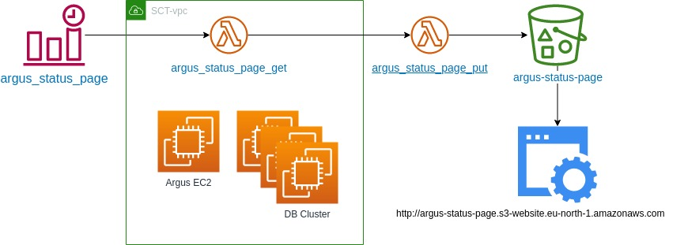

# Argus Status Page documentation

## Motivation
In order for all users to quickly understand the reachability of Argus system we need to implement a simple status page showing the status of Argus API, Web UI reachability, and the Cluster status.

## Solution overview
Argus status page implemented as serverless arhitecture due to being much cheaper than the ec2 instance.

component diagram:

1. Time Event([argus_status_page](https://eu-north-1.console.aws.amazon.com/events/home?region=eu-north-1#/eventbus/default/rules/argus_status_page)) trigger lambda function [argus_status_page_get](https://eu-north-1.console.aws.amazon.com/lambda/home?region=eu-north-1#/functions/argus_status_page_get) every 10 minutes(0/10 * * * ? *)
2. Lambda function [argus_status_page_get](https://eu-north-1.console.aws.amazon.com/lambda/home?region=eu-north-1#/functions/argus_status_page_get), locates inside SCT-vpc, get status of Argus instance and DB and  put results into [argus_status_page_put](https://eu-north-1.console.aws.amazon.com/lambda/home?region=eu-north-1#/functions/argus_status_page_put) lambda function
3. [Argus_status_page_put](https://eu-north-1.console.aws.amazon.com/lambda/home?region=eu-north-1#/functions/argus_status_page_put) lambda function put results into [argus-status-page](https://s3.console.aws.amazon.com/s3/buckets/argus-status-page?region=eu-north-1) S3 bucket.
4. [Argus-status-page](https://s3.console.aws.amazon.com/s3/buckets/argus-status-page?region=eu-north-1) S3 bucket is hosting [Static website](http://argus-status-page.s3-website.eu-north-1.amazonaws.com) that presents Argus status

## Solution details
### Details of Lambda function [argus_status_page_get](https://eu-north-1.console.aws.amazon.com/lambda/home?region=eu-north-1#/functions/argus_status_page_get):

* Uses [requests](https://eu-north-1.console.aws.amazon.com/lambda/home?region=eu-north-1#/layers/requests/versions/2) that created and uploaded manually according to [documentation](https://docs.aws.amazon.com/lambda/latest/dg/configuration-layers.html) (python3.10)

```
pip install --target ./package/python requests
cd package
zip -r ../requests.zip .
```

* Use function argus_status_page_put as the destination on failure and success

* Code:
```

import requests
import traceback
from datetime import datetime, timezone

scylla_node_ips = ["10.0.2.59", "10.0.2.153", "10.0.1.247"]
argus = "10.0.2.112"

def lambda_handler(event, context):
    try:
        json_output = []
        r = requests.get(f"https://{argus}/api/v1/version", verify=False)
        json_output.append({"status": r.status_code, "response": r.json(), "node_type": "argus", "ip": argus})
    except:
        json_output.append({"status": "fail", "response": traceback.format_exc(), "node_type": "argus", "ip": argus})

    for scylla_node_ip in scylla_node_ips:
        try:
            r = requests.get(f'http://{scylla_node_ip}:10000/failure_detector/simple_states', headers={'Accept': 'application/json'})
            json_output.append({"status": r.status_code, "response": r.json(),  "node_type": "scylla", "ip": scylla_node_ip})
        except:
            json_output.append({"status": "fail", "response": traceback.format_exc(), "node_type": "argus", "ip": argus})

    return {"time": str(datetime.now(timezone.utc)), "statuses": json_output}
```

### Details of Lambda function [argus_status_page_put](https://eu-north-1.console.aws.amazon.com/lambda/home?region=eu-north-1#/functions/argus_status_page_put):

Code:
```
import json
import boto3

s3 = boto3.client('s3')
s3_bucket_name = "argus-status-page"

def lambda_handler(event, context):
    s3.put_object(Body=json.dumps(event["responsePayload"]), Bucket=s3_bucket_name, Key='status.json', ACL='public-read')
```

### Lambdas permissions details:
* Each lambda uses its own role that is created during lambda creation.
* argus_status_page_get function has additional access to the SCT-vpc network
* Both lambdas roles extended by [argus-status-page](https://us-east-1.console.aws.amazon.com/iam/home#/policies/arn:aws:iam::797456418907:policy/argus-status-page) policy that provide access trigger [argus_status_page_put](https://eu-north-1.console.aws.amazon.com/lambda/home?region=eu-north-1#/functions/argus_status_page_put) function and access to [argus-status-page](https://s3.console.aws.amazon.com/s3/buckets/argus-status-page?region=eu-north-1) S3 bucket
* To deploy/update lambdas, use DevOpsAccessRole in cloudius-systems account
```
{
    "Version": "2012-10-17",
    "Statement": [
        {
            "Sid": "VisualEditor0",
            "Effect": "Allow",
            "Action": "lambda:InvokeFunction",
            "Resource": "arn:aws:lambda:eu-north-1:797456418907:function:argus_status_page_put"
        },
        {
            "Sid": "VisualEditor1",
            "Effect": "Allow",
            "Action": [
                "s3:*"
            ],
            "Resource": [
                "arn:aws:s3:::argus-status-page",
                "arn:aws:s3:::argus-status-page/*"
```

### Deploying the website

The website is currently located in `/scripts/argus-status-page`. It's a single static page with a script that fetches and renders the `status.json` into a nicely presentable format.
The webpage has following dependencies (provided by CDNs):

* Bootstrap 5.2
* Font Awesome 6.4
* day.js

To deploy, you will need to `cd` into the status page directory and upload it to the website's s3 bucket, like so:

```bash
aws s3 cp --recursive --acl 'public-read' --exclude "status.json" . s3://argus-status-page/
```
