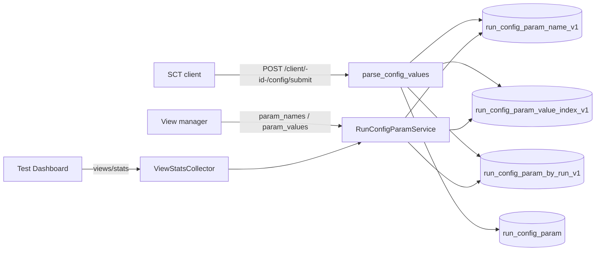
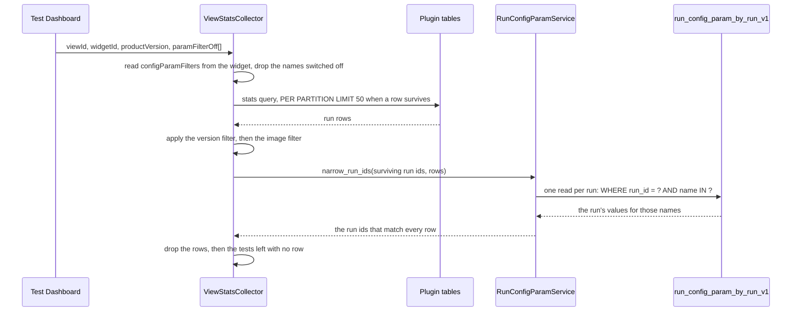

# ARGUS-157 — Filter a Test Dashboard widget by an SCT config parameter

**Date**: 2026-09-21

## Design drivers

- `run_config_param` is keyed `((name, value)) -> run_id`. It answers "which
  runs match" and nothing else; autocomplete and a presence test need key
  shapes it does not have.
- No read may scan the cluster. A `SELECT DISTINCT` and a whole-partition read
  of a high-cardinality parameter are both out.
- The stats path runs on every dashboard poll, so the filter must cost reads
  proportional to the runs already fetched, not to a parameter's history.
- A reader may narrow what the widget shows, never widen past the lock.
- The index tables start empty, so the writes and the backfill ship and run
  before any read depends on them.

## Goals

- A Test Dashboard widget carries `configParamFilters`: rows of a parameter name
  and either a concrete value or "any value". Rows AND together.
- Both fields are searched, not typed, from new endpoints over a name index and
  a value index.
- The view stats path applies the rows server-side and prunes tests left with no
  run.
- The dashboard shows the rows as badges after the version selector; a reader
  switches one off for the session.
- `SCTTestRun.get_config_params()` stops scanning the whole table.

## Non-goals

- No filter on the release dashboard. The setting lives on the view widget.
- No filter on any other widget type.
- No operator beyond equality and "is set": no regex, no negation, no ordering.
- No stored per-reader preference. A badge toggle dies with the page.
- No change to the run Details page, to `SctConfig.svelte`, or to the Go CLI.
- No secret handling in the value index. SCT does not put secrets in its config;
  this design does not add a denylist.

## Design

`ClientService.parse_config_values` is the single point where a flattened
parameter is written. It gains three sibling writes: the run's own row, the
value index and the name catalogue. `RunConfigParam` keeps its shape and its
writer, so nothing reading it today changes.



The match reads one partition per candidate run, so a concrete value and "any
value" cost the same, and neither depends on how many runs carried the
parameter.



Decision rules:

| Condition | Behavior |
|---|---|
| A row's value is a string | The run's value for that name must equal it |
| A row's value is `null` | The name must be present and its value outside `{"", "null", "None"}` |
| The run has no row in the by-run table | It does not match |
| A row carries a blank name | It is dropped before the filter runs |
| `configParamFilters` is absent or empty | The stats output is what it is today, limit included |
| `paramFilterOff` names a row the widget does not configure | It is ignored |

`parse_config_values` writes `str(value) or "null"`, so a JSON `null` is stored
as `"None"`, an empty string as `"null"` and `False` as `"False"`. "Is set"
rejects `{"", "null", "None"}`, and a parameter whose genuine value is the text
`None` cannot be told apart from an absent one.

The run window bounds the answer. The stats query returns the newest 15 runs
per job, so a filter can only match inside that window; a widget carrying a
surviving row raises it to 50.

## Contracts

### Inputs

```
GET /api/v1/views/stats?viewId=&widgetId=&productVersion=&includeNoVersion=&imageId=&limited=&force=
                       &paramFilterOff=<name>&paramFilterOff=<name>
```

`paramFilterOff` repeats once per row switched off, named by the row's parameter
name. Absent means every configured row applies.

### Outputs

```sql
CREATE TABLE run_config_param_by_run_v1 (
    run_id UUID,
    name TEXT,
    value TEXT,
    PRIMARY KEY (run_id, name)
);

CREATE TABLE run_config_param_value_index_v1 (
    name TEXT,
    value TEXT,
    PRIMARY KEY (name, value)
);

CREATE TABLE run_config_param_name_v1 (
    bucket TEXT,
    name TEXT,
    PRIMARY KEY (bucket, name)
);
```

`bucket` is the constant `"all"`, so the name catalogue is one partition and one
read. `sync-models` issues all three.

```json
"configParamFilters": [
  {"name": "sct_config.unified_package", "value": null},
  {"name": "sct_config.backend", "value": "aws"}
]
```

```
GET /api/v1/run_configs/param_names?query=<substring>
    {"status": "ok", "response": ["sct_config.unified_package", ...]}

GET /api/v1/run_configs/param_values?name=<name>&query=<prefix>
    {"status": "ok", "response": ["aws", "gce", ...]}
```

`param_names` substring-matches over one partition. `param_values` is a
clustering range on the chosen name, so it matches by prefix and is
case-sensitive, and it is capped. Both take `Depends(api_current_user)`.

### Module API

```python
@dataclass(frozen=True, slots=True)
class ConfigParamFilter:
    name: str
    value: str | None          # None means "is set to a non-empty value"


class RunConfigParamService:
    def search_names(self, query: str, limit: int = 100) -> list[str]: ...
    def search_values(self, name: str, query: str, limit: int = 100) -> list[str]: ...
    def narrow_run_ids(self, run_ids: set[UUID], filters: Sequence[ConfigParamFilter]) -> set[UUID]: ...


def parse_filters(raw: object) -> list[ConfigParamFilter]: ...   # raises DataValidationError
```

```python
# argus/backend/plugins/core.py — the run window becomes a parameter
@classmethod
def _stats_query(cls, per_partition_limit: int = 15) -> str: ...

@classmethod
def get_stats_for_release(cls, release, build_ids=list[str], per_partition_limit: int = 15): ...
```

## Risks

| Risk | Response |
|---|---|
| A read lands before the backfill and every filter answers empty | Ship the writes and run the backfill as their own change, then the reads |
| The name catalogue takes one write per parameter per config submit | A process-level seen-set makes the steady-state write rate ~0; the names repeat across runs |
| A high-cardinality parameter grows its value-index partition without bound | The value search is a bounded clustering range, never a whole-partition read |
| Raising the window to 50 triples the stats read for a filtered widget | Only a widget that carries a row pays it; an unfiltered widget is untouched |
| Two widgets differing only by their rows share one stats bucket and overwrite each other | The bucket key takes the widget position when rows are configured |
| Pruning shrinks the group counts and the total | Intended: the widget counts what ran under the configuration |

## Deferred work

The same filter on the release dashboard would reuse `RunConfigParamService`
whole, so `narrow_run_ids` stays free of any view concept. `run_config_param`
stays in place and still written; once nothing reads it, it can be dropped in
favour of the by-run table.

---

Files, internal functions, tests, and line numbers go to `plan.md`.
