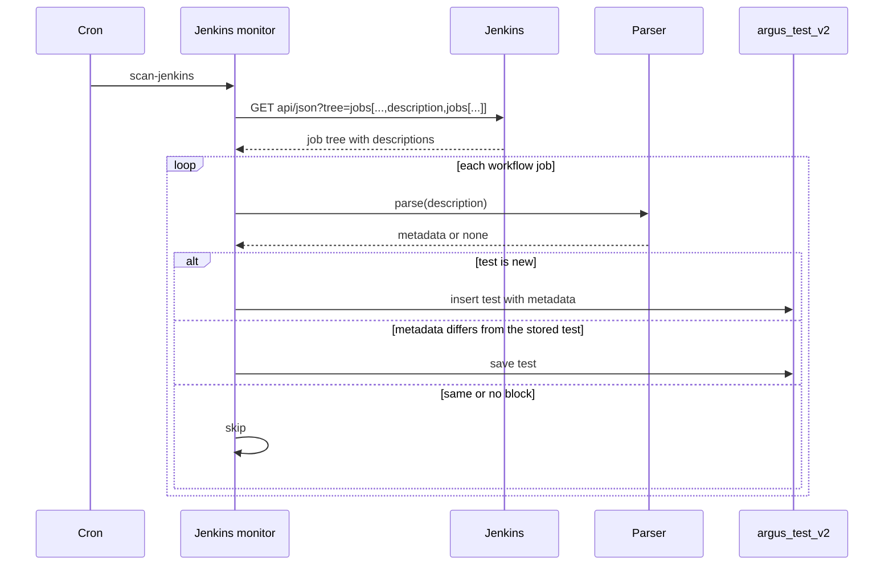
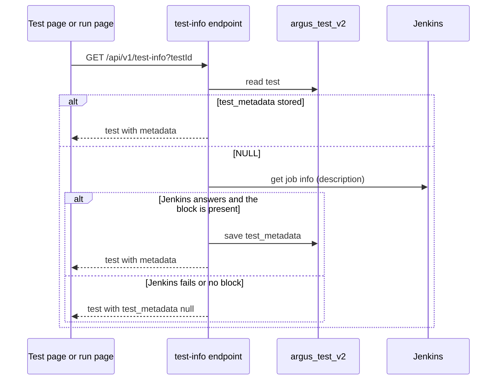
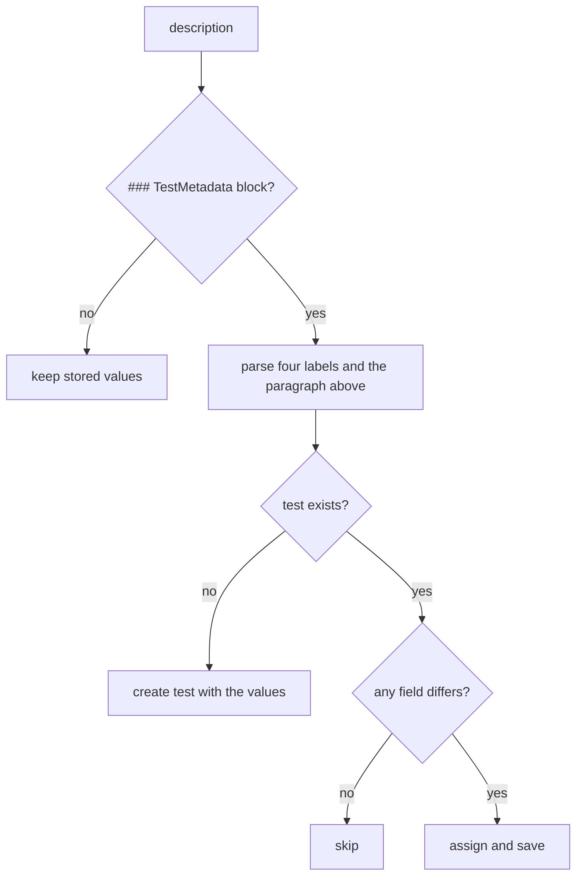

# ARGUS-185 — Persist and surface SCT test metadata

**Date**: 2026-09-17

## Design drivers

- The scanner runs every five minutes over about 31,000 Jenkins jobs. The
  metadata must arrive in the one request the scan already makes, not in one
  request per job.
- Jenkins drops the `<testMetadata>` element when it saves a job. The job
  description is the only channel that survives, so its grammar is the
  contract with SCT.
- A refresh on every scan must write nothing in the steady state, or the cron
  turns into a constant write load on `argus_test_v2`.
- Every consumer reads a test through `model_dump()`. The field names on the
  model are the API, so they mirror the SCT names.
- SCT sends four labels and a prose description today and holds five more
  labels in the YAML. The metadata must sit under one name on the test and
  grow by adding a field, without a new column per label.

## Goals

- `ArgusTest` carries a `test_metadata` user-defined type with `description`,
  `tier`, `test_type`, `duration_class` and `supported_backends`.
- The scanner fills them on creation and refreshes them on every scan, and
  saves a row only when a value changed.
- The planning search, the planning grid and the test picker show the labels
  and the description.
- The run page gains a Test Info tab with the description and the labels.
- The test info read fills a missing `test_metadata` from Jenkins once, so a
  test shows its metadata before the scanner reaches it.

## Non-goals

- No change to the SCT YAML, the SCT job creator, or the description grammar.
- No parsing of `config.xml` or of build descriptions.
- No editing of the metadata in the admin panel. Jenkins owns the values.
- No copy of the metadata on a run.
- No change to the Go CLI.
- No storage for labels SCT does not write to the job yet.
- No change to the existing `ArgusTest.description` column. The prose lives
  in the type, next to the labels it came with.

## Design

Five components take part. The Jenkins monitor asks Jenkins for the job tree
with each job's description, walks it as today, and hands each workflow job's
description to the parser. The parser turns the `### TestMetadata` block and
the paragraph above it into a metadata value, or nothing when the block is
absent. The monitor applies the value to the test, on creation and on every
later scan, and saves the test when a field changed. The model stores the
five fields in a `test_metadata` user-defined type, one column of
`argus_test_v2`, synced and registered with the driver like the other core
types. The existing read paths serialize
the test whole, so the planning API, the test info endpoint and the client
payload carry the fields with no change. The test info read adds one step: a
test with no stored metadata asks Jenkins for its job description, parses it,
saves the result on the test and returns it. The planning payloads serve
hundreds of tests per request and stay on stored values. Two frontend
surfaces render the fields: the planner (search item, selected list, grid
tile) and a new tab on the run page, which already receives the test.



The test info read, when the stored type is NULL:



Decision rules for one job:



The absent-block rule protects a test whose job was edited by hand in Jenkins
or created from a Jenkinsfile the SCT creator cannot read. The weekly job
regeneration restores the block, and the next scan restores the values.

Failure behavior. A Jenkins error fails the scan as it does today, and the
next cron run retries. On the test info read a Jenkins error, a missing job
or an absent block leaves the type NULL, logs at warning level and returns
the test; the read never fails because of Jenkins. A test without a
`build_system_id` skips the fallback. A description the parser cannot read
counts as no block. A malformed `supported_backends` value becomes an empty list. Existing
rows return the type column as NULL, which reads as no metadata. A NULL list
inside the type reads as an empty list.

## Contracts

### Inputs

Jenkins, one request per scan:
`GET <JENKINS_URL>/api/json?tree=jobs[url,name,fullName,_class,description,jobs[...]]`
nested ten levels, the depth python-jenkins uses today. Fields used per job:
`fullName`, `name`, `url`, `_class`, `description`, `jobs`.

Jenkins, on a test info read with no stored metadata: the job info of
`build_system_id` (`GET <JENKINS_URL>/job/<path>/api/json`), field
`description`. At most one request per test for its lifetime, since the
result is saved.

The description grammar SCT writes, and the parser reads. Line endings may be
`\n` or `\r\n`. The block is a `### TestMetadata` line followed by four
`key: value` lines. The prose is the last paragraph before the block that is
not a heading and not a bare Jenkinsfile path.

```
<jenkinsfile path or job description>

<prose description>

### TestMetadata
tier: tier1
test_type: longevity
duration_class: short
supported_backends: ['aws', 'gce', 'azure']
```

`supported_backends` is a Python list literal of strings. `[]` and `n/a`
read as an empty list. A missing key reads as `null`.

### Outputs

A `test_metadata` object on every serialized `ArgusTest`. It appears in
`GET /api/v1/test-info`, in the planning search, gridview and explode-group
payloads, in `GET /tests`, and in the client run payload. Excerpt of
`GET /api/v1/test-info?testId=...`:

```json
{
  "test": {
    "name": "longevity-10gb-3h-test",
    "test_metadata": {
      "description": "Basic longevity test running cassandra-stress write workload ...",
      "tier": "tier1",
      "test_type": "longevity",
      "duration_class": "short",
      "supported_backends": ["aws", "gce", "azure"]
    }
  }
}
```

A test without metadata returns `"test_metadata": null`. Inside the object a
missing label is `null` and a missing backend list is `[]`. A consumer treats
a `null` as "unknown", not as a value.

The CQL type `test_metadata` in the Argus keyspace: `description text`,
`tier text`, `test_type text`, `duration_class text`,
`supported_backends list<text>`. A later label arrives as `ALTER TYPE ...
ADD`, which `sync-models` issues.

### Module API

```python
class TestMetadata(UserType)
def parse_test_metadata(description: str | None) -> TestMetadata | None
def apply_test_metadata(test: ArgusTest, description: str | None) -> bool
```

`TestMetadata` holds `description`, `tier`, `test_type`, `duration_class`
(each `str | None`) and `supported_backends: list[str]`, every field with a
default, since the driver validates a registered type on every read. The
parser returns `None` when the block is absent. `apply_test_metadata`
assigns the parsed type to `test.test_metadata` and returns whether it
differs from the stored one. It does not save.

## Risks

| Risk | Response |
|---|---|
| The tree request with descriptions grows the payload or times out | Measured on 2026-09-17: one request over 31,499 jobs returned within the timeout. The scan logs its duration. |
| A job edited by hand loses the block | The absent-block rule keeps the stored values. |
| The cron writes rows on every scan | Save only when a field differs. |
| SCT renames a label or adds a fifth line | The parser reads the keys it knows and ignores the rest. A rename is an SCT contract change and arrives as a new task. |
| Old code and new code read the table during the deploy | The type and the column are additive. `sync-models` runs before the new scanner. |
| A required field in a registered type breaks every read of the table | Every field of the type carries a default. |
| The test info read gains a Jenkins dependency | Fallback only when the type is NULL; the result is saved; a Jenkins failure returns the test unchanged. |
| A job without the block costs a Jenkins call on every test info read | Accepted: one call per page view for such tests. The scanner saves nothing for them, so the read has nothing to cache. Revisit with a negative marker if the load shows. |
| Scanner and read path both write `test_metadata` | Both write the same parsed value from the same description; a race writes it twice. |

## Deferred work

- The five labels SCT holds in the YAML and does not write to the job:
  `stress_tools`, `workload`, `features`, `nemesis_labels`, `team_ownership`.
  They arrive as fields added to the type when SCT writes them.
- `argus plan search` in the Go CLI printing the description and the labels
  (ARGUS-155 track 2 acceptance).
- The SCT findings from this investigation go upstream: Jenkins drops
  `<testMetadata>`; the job creator's list regex misses `'''[...]'''` config
  lists; the runtime client does not send `test_metadata`.

---

Files, internal functions, tests, and line numbers go to `plan.md`. On the
spike path the code diff carries them, and the spec keeps this shape. A spec
near 150 lines, diagrams included, reads in one sitting. Above that, consider
a split and propose it in the spec. This footer stays in every spec.
