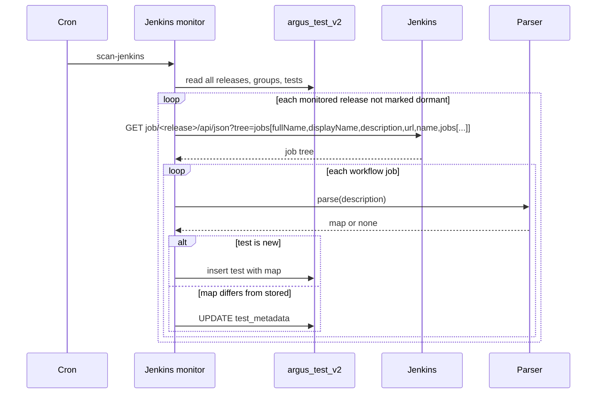

# ARGUS-185 — Show what a test does where its runs are planned and read

**Date**: 2026-09-18

## Design drivers

- The scan runs every five minutes. It reads each release tree once, with
  only the fields it uses, and skips a release marked dormant in Argus.
- The mapper writes every column on `save()`. A refresh compares first and
  writes the one column, only when the value differs.
- SCT owns the description grammar and will add labels. Storage takes a key
  it has never seen without a schema change.
- Every consumer reads a test whole through `model_dump()`. The column name
  and the key names are the API.

## Goals

- `ArgusTest` carries `test_metadata`, a map of every `key: value` line SCT
  wrote plus the prose description.
- The scanner fills it on creation and refreshes it on every scan.
- The planner search item, selected list and grid tile show the labels and
  the description. The run page gains a Test Info tab.
- A dormant release drops out of the scan.

## Non-goals

- No search or filter by label, and no lookup table for one.
- No read-time fetch from Jenkins on the test info endpoint.
- No user-defined type and no new table.
- No parsing of `config.xml` or of build descriptions.
- No admin editing, no Go CLI change, no metadata copy on a run.

## Design

The **Jenkins monitor** (`scan-jenkins`) loads every release, group and test
of Argus into memory, as it does today, then requests the job tree of each
monitored, non-dormant release with the fields it reads. For each workflow
job it hands the description to the **parser**, which returns a map or
nothing. The monitor sets the map on a new test and, on an existing test,
writes the one column when the parsed map differs from the stored one. The
**model** holds the map. The read paths are untouched: `model_dump()` carries
the column to the test info endpoint, the planner search, gridview and
explode-group payloads, and the client payload. The **planner** and the **run
page** render it.

```python
class ArgusTest(Document):
    ...
    test_metadata: dict[str, str] = Field(default_factory=dict)
```

```sql
ALTER TABLE argus_test_v2 ADD test_metadata map<text, text>;
```

`sync-models` issues the DDL. An old row reads the column as NULL, and the
mapper turns it into an empty map before the model sees it.



Storage decision. Three options were weighed. A user-defined type gives
typed fields, but each new label is an `ALTER TYPE` and a required field
breaks every read of the table. A separate table keyed by test and field
enables a search by label, at the cost of a second read per test and a second
writer. A map is one column, one read, and takes an unknown key; it offers no
search. The use case iterates over a plan or a release, so the map wins. A
lookup table comes as a follow-up when a search use case exists.

Rules:

- The parser reads the `key: value` lines after the `### TestMetadata`
  heading until a line does not match, and keeps every key.
- The prose is the last paragraph above the heading that is not a heading
  and not a bare Jenkinsfile path. It is stored under the key `description`.
- A value written as a list literal is stored as a JSON array string. Every
  other value is stored trimmed, as written.
- The comparison is a map equality. Equal maps write nothing.

| Condition | Behavior |
|---|---|
| Jenkins fails for one release | Skip that release, log once, the next cron run retries |
| The description has no block | Keep the stored map, whatever it holds |
| A line in the block does not match `key: value` | The block ends there |
| The map column is NULL on an old row | Read as an empty map |
| A release matches the monitored patterns but is not in Argus yet | Scan it; that is how a release is discovered |

## Contracts

### Inputs

```
GET <JENKINS_URL>/job/<release>/api/json?tree=jobs[fullName,displayName,description,url,name,jobs[...]]
    # one request per monitored release not marked dormant; nested nine levels
    # fields used: fullName, displayName, description, url, name, jobs
    # _class arrives on every object unrequested, and naming it in the tree
    # risks losing it, so the tree leaves it out
```

The description grammar SCT writes. Line endings are `\n` or `\r\n`.

```
<jenkinsfile path or job description>

<prose description>

### TestMetadata
tier: tier1
test_type: longevity
duration_class: short
supported_backends: ['aws', 'gce', 'azure']
```

### Outputs

The column on every serialized test. Excerpt of `GET /api/v1/test-info?testId=...`;
a planner gridview or search entry carries the same object.

```json
{
  "test": {
    "name": "longevity-10gb-3h-test",
    "test_metadata": {
      "description": "Basic longevity test running cassandra-stress write workload ...",
      "tier": "tier1",
      "test_type": "longevity",
      "duration_class": "short",
      "supported_backends": "[\"aws\", \"gce\", \"azure\"]"
    }
  }
}
```

A consumer reads a key it knows and ignores the rest. A missing key means
unknown. `supported_backends` is parsed as a JSON array. A test without
metadata has `"test_metadata": {}`.

### Module API

```python
def parse_test_metadata(description: str | None) -> dict[str, str] | None
def apply_test_metadata(test: ArgusTest, description: str | None) -> bool
```

The parser returns `None` when the heading is absent. `apply_test_metadata`
assigns the parsed map to `test.test_metadata` and returns whether it changed.
It does not write.

## Risks

| Risk | Response |
|---|---|
| SCT renames a key | The old key stays on a test until its job regenerates; the frontend reads the new key and shows nothing for the old one. A rename is an SCT contract change and arrives as a task. |
| The map has no types | The frontend parses the one list it renders and treats every other value as text. |
| Per-release requests add up | Measured 2026-09-18: 20 monitored folders, 3.5 s in total, the slowest 0.28 s, 7 MB in total. The scan logs the time per release. |

## Deferred work

- A lookup table `((test_id, field_name), field_value)` when a search by
  label is needed.
- Labels SCT holds in the YAML and does not write to the job yet arrive as
  new keys with no schema change.
- A proposal to SCT for a fenced YAML block in the description in place of
  the four-line grammar. The map takes it without a schema change.
- Upstream findings for scylla-cluster-tests#14818: Jenkins drops the injected
  `<testMetadata>` element; the job creator's list regex misses `'''[...]'''`
  configs; the runtime client does not send `test_metadata`.

---

Files, internal functions, tests, and line numbers go to `plan.md`. On the
spike path the code diff carries them, and the spec keeps this shape. A spec
near 150 lines, diagrams included, reads in one sitting. Above that, consider
a split and propose it in the spec. This footer stays in every spec.
