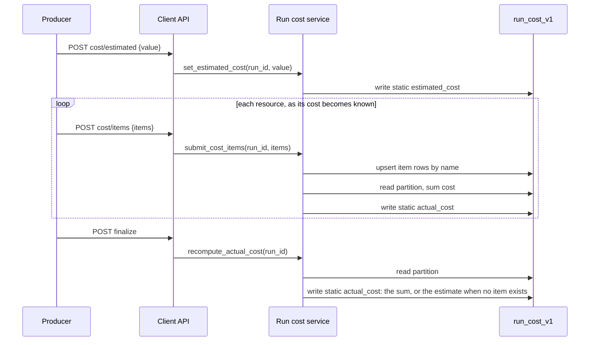

# ARGUS-205 — Show the cost of a test run

**Date**: 2026-09-17

## Design drivers

- Cost is its own concept: its own table keyed by the run identifier every
  client already sends, no change to any plugin run model, UDT or index.
- The producer knows prices; Argus does not. Argus stores the estimate and
  each item cost it is given, and sums the items into the run's actual cost.
- Item costs arrive from several places at several times: node termination,
  a pipeline cleanup step, a later global cleanup that finds a leaked
  instance. Each adds to the same run, and a client that crashes mid-run
  still leaves a partial actual figure.
- The run page reads one partition for everything it shows.
- An unknown figure is null and never renders as zero.
- A producer that reports nothing sees no change.

## Goals

- Store a producer-sent estimated USD cost per run.
- Store named cost items per run, each with a category, a cost, an optional
  pricing tier and a leaked flag. Categories are free-form.
- Argus computes the run's actual cost as the sum of its item costs.
- Two idempotent client write endpoints: run estimate and items. Neither
  reads the run.
- One read endpoint for the run page: totals, items, and per-category sums.
- Methods on the base Python client, so every plugin client inherits them.
- A Costs tab on the run page with an empty state when nothing was reported.

## Non-goals

- The cleanup scripts as a producer. The `leaked` flag exists so they can
  become one; no producer sets it in this change.
- A partial or incomplete flag on the actual figure.
- Live cost during a run. The estimate stands until items arrive.
- Aggregation, filtering or a dashboard across runs
  ([ARGUS-218](https://scylladb.atlassian.net/browse/ARGUS-218)).
- Pricing, rates, instance-hours or currency logic in Argus.
- A per-item estimate. Items carry the final cost only.
- A Go CLI command for dtest and driver-matrix.
- Backfilling runs that finished before this change.

## Design

The **producer** (SCT through the Python client) sends the run estimate
before it provisions, then one item per resource as soon as it knows that
resource's final cost. The **client API** validates each call. The **run
cost service** writes under the run identifier the client already sends, as
`submit_config` does today, without reading the run. It recomputes the actual
cost from the partition after every item write and once more when the run is
finalized. The **Costs tab** reads one partition and renders it.

One table. The partition is the run, the static columns hold the run's totals
once, and each clustered row is one item. The statics live on a carrier row
whose `name` is the empty string; Argus writes that row, and a client cannot
name an item `""`. No timestamps and no build identifiers: a dashboard that
needs `build_id` gets it from its own table.

```python
class RunCost(Document):
    run_id: Annotated[UUID, PrimaryKey()]
    name: Annotated[str, ClusteringKey()]
    estimated_cost: Annotated[Optional[float], Double(), Static()] = None
    actual_cost: Annotated[Optional[float], Double(), Static()] = None
    cost: Annotated[float, Double()]
    category: str
    pricing_tier: Optional[str] = None
    leaked: bool = False

    class Settings:
        name = "run_cost_v1"
```



Decision rules:

- An item is keyed by its name. A repeated name overwrites the row, so a
  repeated call is idempotent and a corrected figure replaces the old one.
- `actual_cost` is the sum of `cost` over every item row in the partition,
  leaked items included. It is null while the run is in flight and no item
  has arrived.
- The run finalize path in `ClientService.finish_run` recomputes it once
  more, so a sum left stale by a racy last write is repaired when the run
  ends. When the partition has no items at finalize, `actual_cost` takes the
  value of `estimated_cost`, so a producer that reports only an estimate
  still ends with an actual figure.
- The totals are written only by Argus. The items endpoint accepts item
  fields alone, so a client cannot set `estimated_cost` or `actual_cost`
  through it; the estimate endpoint writes the one static, and the recompute
  writes the other.
- The row named `""` is reserved. It carries the statics, so the partition
  exists before any item arrives and the mapper can save it like any row. An
  item with an empty name is rejected at the boundary, and the read leaves
  the carrier out of the item list and the sum.
- The per-category breakdown is a read-time fold over the item rows. It is
  not stored.
- Every amount is a finite number of zero or more. Zero is accepted as a
  real figure. Only a negative or a non-finite amount is rejected. A producer
  that cannot price a resource sends nothing, and the client docstring says
  so.

Failure behavior:

- The run identifier names no run: the write lands anyway, as it does for
  `submit_config`; nothing reads it, and no run page shows it.
- An amount, a name or a category fails validation: the whole call fails,
  nothing is written.
- Two item writes race on the sum: the later recompute lands the complete
  sum; the next write, or the finalize recompute, repairs a stale one.
- No cost reported: the read returns null totals and an empty item list. The
  tab shows "No cost reported for this run".

## Contracts

### Inputs

None. The change reads no new external source and reads no run table.

### Outputs

Client writes, under `/api/v1/client`, authenticated like every client route:

| Method | Path | Body |
|---|---|---|
| POST | `/testrun/{run_id}/cost/estimated` | `{"value": 118.40}` |
| POST | `/testrun/{run_id}/cost/items` | `{"items": [...]}` |

An item:

```json
{"name": "longevity-db-node-1", "category": "db_node", "cost": 12.30,
 "pricing_tier": "spot", "leaked": false}
```

`name`, `category` and `cost` are required; `pricing_tier` defaults to null
and `leaked` to false. `name` must not be empty, because `""` is the carrier
row Argus owns. Names are unique within one payload. Both bodies carry
`schema_version` like every client call.

Read, for the run page:

| Method | Path |
|---|---|
| GET | `/api/v1/cost/run/{run_id}` |

```json
{"estimated_cost": 118.40, "actual_cost": 96.12,
 "items": [{"name": "...", "category": "db_node", "cost": 12.30,
            "pricing_tier": "spot", "leaked": false}],
 "by_category": {"db_node": 73.80, "loader": 22.32}}
```

Items are sorted by category then name. Responses use the envelope in
`docs/standards/backend/api.md`. The run page already holds the run
identifier, so the tab passes it. `docs/api_usage.md` lists all three routes.

The Costs tab shows the estimate and the actual figure, a table of items
grouped by category with a subtotal per category, a mark on a leaked item,
and "Not reported" for a null figure.

### Module API

Python client, on the base `ArgusClient`, inherited by every plugin client:

```python
@dataclass
class CostItem:
    name: str
    category: str
    cost: float
    pricing_tier: str | None = None
    leaked: bool = False

def set_estimated_cost(self, run_id: UUID, value: float) -> None
def submit_cost_items(self, run_id: UUID, items: list[CostItem]) -> None
```

Backend service, called by the client API and the read route:

```python
class RunCostService:
    def set_estimated_cost(self, run_id: UUID, value: float) -> dict
    def submit_cost_items(self, run_id: UUID, items: list[CostItemRequest]) -> dict
    def recompute_actual_cost(self, run_id: UUID) -> None
    def get_run_cost(self, run_id: UUID) -> dict
```

`ClientService.finish_run` calls `recompute_actual_cost`. A run with no
partition at all is left alone.

## Risks

| Risk | Response |
|---|---|
| A producer sends `0` for a resource it could not price | Argus cannot tell it from a free resource; the client docstring says to send nothing for an unknown price |
| Two item writes race and one sum is stale | The next write and the finalize path recompute over the full partition |
| A producer reuses an item name for two resources | The second write overwrites the first; the producer owns unique names, as for resource names today. A later, more precise figure may overwrite on purpose |
| A static write before any item row exists | Verified against ScyllaDB 2025.4 with coodie: a null clustering key is rejected by the server, an empty string is accepted, so the statics ride on the carrier row named `""`. `find(run_id=...).update(...)` also writes a static with the partition key alone |
| An item write erases the statics | Verified: `Document.save()` inserts every column, statics included, as null. The service writes an item with `update()` on the item columns only, never with `save()`, and writes a total with `update()` so the estimate does not null the actual |
| A client names an item `""` and overwrites the carrier | The request model rejects an empty name |

## Deferred work

- The cleanup scripts as a producer: they submit items with `leaked: true`
  and the sum absorbs them. The column and the endpoint are in place.
- The dashboard in ARGUS-218 aggregates `estimated_cost` and `actual_cost`
  and filters on `category`, `pricing_tier` and `leaked`, from a table of its
  own; this table stays the per-run source.
- A per-run partial flag, once an unpriced instance has a defined meaning.
- A Go CLI `cost` command for producers without the Python client.
- Backend attribution for xcloud and k8s runs, a dashboard concern.

---

Files, internal functions, tests, and line numbers go to `plan.md`. On the
spike path the code diff carries them, and the spec keeps this shape. A spec
near 150 lines, diagrams included, reads in one sitting. Above that, consider
a split and propose it in the spec. This footer stays in every spec.
