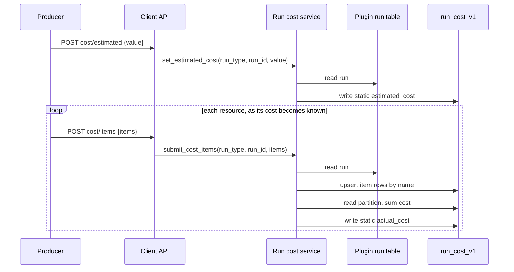

# ARGUS-205 — Show the cost of a test run

**Date**: 2026-09-16

## Design drivers

- Cost is its own concept: its own table keyed by the run's `build_id` and
  `build_number`, no change to any plugin run model, UDT or index.
- The producer knows prices; Argus does not. Argus stores the estimate and
  each item cost it is given, and sums the items into the run's actual cost.
- Item costs arrive from several places at several times: node termination,
  a pipeline cleanup step, a later global cleanup that finds a leaked
  instance. Each adds to the same run, and a client that crashes mid-run
  still leaves a partial actual figure.
- The run page reads one partition for everything it shows.
- An unknown figure is null and never renders as zero.
- A producer that reports nothing sees no change.

## Goals

- Store a producer-sent estimated USD cost per run.
- Store named cost items per run, each with a category, a cost, an optional
  pricing tier and a leaked flag. Categories are free-form.
- Argus computes the run's actual cost as the sum of its item costs.
- Two idempotent client write endpoints: run estimate and items.
- One read endpoint for the run page: totals, items, and per-category sums.
- Methods on the base Python client, so every plugin client inherits them.
- A Costs tab on the run page with an empty state when nothing was reported.

## Non-goals

- The cleanup scripts as a producer. The `leaked` flag exists so they can
  become one; no producer sets it in this change.
- A partial or incomplete flag on the actual figure.
- Live cost during a run. The estimate stands until items arrive.
- Aggregation, filtering or a dashboard across runs
  ([ARGUS-218](https://scylladb.atlassian.net/browse/ARGUS-218)).
- Pricing, rates, instance-hours or currency logic in Argus.
- A per-item estimate. Items carry the final cost only.
- A Go CLI command for dtest and driver-matrix.
- Backfilling runs that finished before this change.

## Design

The **producer** (SCT through the Python client) sends the run estimate
before it provisions, then one item per resource as soon as it knows that
resource's final cost. The **client API** validates each call. The **run
cost service** resolves the run from the run type and identifier the client
already uses, takes its `build_id` and `build_number`, writes the row, and
recomputes the actual cost from the partition after every item write. The
**Costs tab** reads one partition and renders it.

One table, `run_cost_v1`, partitioned by `(build_id, build_number)` with
`name` as the clustering key. `estimated_cost` and `actual_cost` are static
columns, so the partition holds the run's totals once and its items as rows.
Each item row carries `cost`, `category`, `pricing_tier` and `leaked`. No
timestamps and no run identifier: the partition key already names the run.



Decision rules:

- An item is keyed by its name. A repeated name overwrites the row, so a
  repeated call is idempotent and a corrected figure replaces the old one.
- `actual_cost` is the sum of `cost` over every item row in the partition,
  leaked items included. It is null while the partition has no items.
- The per-category breakdown is a read-time fold over the item rows. It is
  not stored.
- Every amount is a finite number greater than zero. Zero is rejected because
  a producer that cannot price a resource must send nothing, not zero.

Failure behavior:

- The run is missing, or has no `build_number`: the call fails, nothing is
  written.
- An amount, a name or a category fails validation: the whole call fails,
  nothing is written.
- Two item writes race on the sum: the later recompute lands the complete
  sum, and the next write repairs a stale one.
- No cost reported: the read returns null totals and an empty item list. The
  tab shows "No cost reported for this run".

## Contracts

### Inputs

None. The change reads no new external source. The run lookup uses the run
tables Argus already owns.

### Outputs

Client writes, under `/api/v1/client`, authenticated like every client route:

| Method | Path | Body |
|---|---|---|
| POST | `/testrun/{run_type}/{run_id}/cost/estimated` | `{"value": 118.40}` |
| POST | `/testrun/{run_type}/{run_id}/cost/items` | `{"items": [...]}` |

An item:

```json
{"name": "longevity-db-node-1", "category": "db_node", "cost": 12.30,
 "pricing_tier": "spot", "leaked": false}
```

`name`, `category` and `cost` are required; `pricing_tier` defaults to null
and `leaked` to false. Names are unique within one payload. Both bodies carry
`schema_version` like every client call.

Read, for the run page:

| Method | Path |
|---|---|
| GET | `/api/v1/cost/run?build_id=<str>&build_number=<int>` |

```json
{"estimated_cost": 118.40, "actual_cost": 96.12,
 "items": [{"name": "...", "category": "db_node", "cost": 12.30,
            "pricing_tier": "spot", "leaked": false}],
 "by_category": {"db_node": 73.80, "loader": 22.32}}
```

Items are sorted by category then name. Responses use the envelope in
`docs/standards/backend/api.md`. Query parameters carry the key because a
`build_id` contains slashes. `docs/api_usage.md` lists all three routes.

The Costs tab shows the estimate and the actual figure, a table of items
grouped by category with a subtotal per category, a mark on a leaked item,
and "Not reported" for a null figure.

### Module API

Python client, on the base `ArgusClient`, inherited by every plugin client:

```python
@dataclass
class CostItem:
    name: str
    category: str
    cost: float
    pricing_tier: str | None = None
    leaked: bool = False

def set_estimated_cost(self, run_type: str, run_id: UUID, value: float) -> None
def submit_cost_items(self, run_type: str, run_id: UUID, items: list[CostItem]) -> None
```

Backend service, called by the client API and the read route:

```python
class RunCostService:
    def set_estimated_cost(self, run_type: str, run_id: str, value: float) -> dict
    def submit_cost_items(self, run_type: str, run_id: str, items: list[CostItemRequest]) -> dict
    def get_run_cost(self, build_id: str, build_number: int) -> dict
```

Each raises a typed `RunCostError` on a missing run.

## Risks

| Risk | Response |
|---|---|
| The run has no `build_number` | The call fails with a typed error; nothing is written |
| A producer sends `0` to mean unknown | Rejected at the boundary; unknown stays null |
| Two item writes race and one sum is stale | The next write recomputes over the full partition; the plan may add a read-time recompute if this is observed |
| A producer reuses an item name for two resources | The second write overwrites the first; the producer owns unique names, as for resource names today |
| A static-only write of the estimate before any item row exists | The mapper must write partition key plus static columns alone; the plan verifies this against coodie |
| SCT vendors `argus/client` and cannot call the new methods until a release | Cut a client release after the merge, per `docs/pypi-guide.md` |
| A client on an old Argus gets an unknown route | Producers guard the call as they do for other optional reports |

## Deferred work

- The cleanup scripts as a producer: they submit items with `leaked: true`
  and the sum absorbs them. The column and the endpoint are in place.
- The dashboard in ARGUS-218 aggregates `estimated_cost` and `actual_cost`
  and filters on `category`, `pricing_tier` and `leaked`, from a table of its
  own; this table stays the per-run source.
- A per-run partial flag, once an unpriced instance has a defined meaning.
- A Go CLI `cost` command for producers without the Python client.
- Backend attribution for xcloud and k8s runs, a dashboard concern.

---

Files, internal functions, tests, and line numbers go to `plan.md`. On the
spike path the code diff carries them, and the spec keeps this shape. A spec
near 150 lines, diagrams included, reads in one sitting. Above that, consider
a split and propose it in the spec. This footer stays in every spec.
