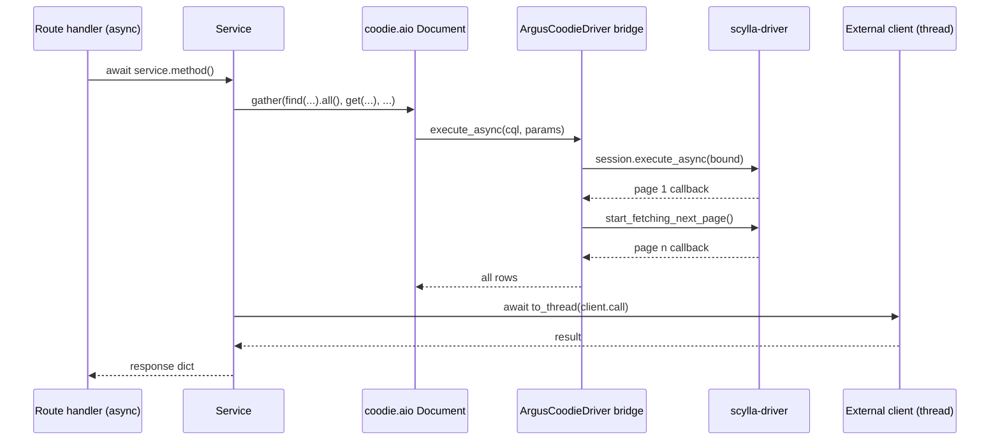
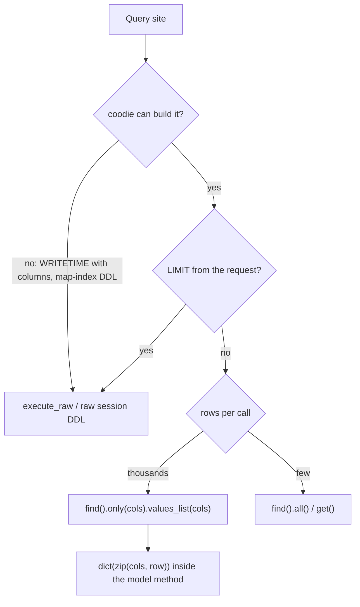

# ARGUS-207 — Run the web backend on the async execution model

**Date**: 2026-09-24

## Design drivers

- `coodie.aio.Document` and `coodie.sync.Document` are unrelated classes and
  every service shares the models, so all models flip in one change; there
  is no per-service path.
- coodie's asyncio bridge resolves on the driver's first page (5000 rows by
  default) while the sync path iterates every page. Argus must page itself
  or lose rows silently.
- coodie prepares one statement per IN length and inlines `LIMIT` and
  `PER PARTITION LIMIT` as literals. IN lists stay chunked; a limit that
  comes from the request stays a bound `?` in raw CQL.
- A query goes through the mapper unless coodie cannot build it. Raw CQL is
  the exception, not a second data-access layer.
- `api_exception_handler` matches on `issubclass(..., APIException)`. A
  concurrency primitive must let that exception reach it unwrapped.
- Nothing blocks the event loop: an external client call runs in a worker
  thread inside the service that owns the client.
- The test suite keeps its sync `TestClient`; only tests that touch models
  directly become coroutines.
- The scylla-driver, gunicorn with four uvicorn workers, and the REST API
  shapes stay as they are.

## Goals

- Every route handler is `async def`; auth dependencies and the DB error
  handler are async.
- Every model is a `coodie.aio.Document`; every read and write awaits it.
- Raw CQL survives at four places only: a `WRITETIME` projection, two
  request-driven limits, and map-index DDL at schema-sync time.
- A result larger than one driver page comes back whole.
- Independent reads inside one service call run together; the serial depth
  of the stats, run page and widget paths drops to a handful per request.
- Jira, GitHub, Jenkins, SMTP, S3, JWKS, subprocess and file I/O run off the
  loop.
- The bugs found in the audit are fixed: the `filter` builtin test in
  `ReleaseStats.collect`, the discarded `.filter()` result in the config
  property lookup (the two planner assignee lookups with the same defect had
  no caller and were deleted instead), duplicated view
  links in `IssueService.get`.
- CLI commands, schema sync and the test suite work on the new model.

## Non-goals

- No driver change (no acsylla), no lifespan hook, no change to the worker
  model or to `gunicorn.conf.py`.
- No move of CPU-bound aggregation off the loop; this change adds the timing
  that decides it later.
- No edit to `argusAI/`, nor to the migration scripts that have run everywhere;
  the two token scripts of 2026-09-08 still have a step to run, so they follow
  the models.
- No rewrite of admin and planner CRUD paths with single-digit round trips.
- No frontend change, no API shape or status code change.
- No new caching layer beyond the existing release stats snapshot.

## Design

This spec runs long because the model flip cannot be split into separate
changes. The pull request is one, by decision, and its commits fall into
three groups that each read alone: sync-safe preparation (suite green after
each commit), the flip by layer (green only at its last commit), and the
concurrency pass (one commit per hotspot, green throughout). The plan carries
the sequence.

**Components**

- `db.py`: a paging-aware asyncio bridge, installed on the already
  subclassed `ArgusCoodieDriver`; the prepared-statement cache, the
  `read_fast*` execution profiles and `get_session()` go away with their
  last callers. The raw session stays for DDL.
- Models: the aio base; `PluginModelBase` declares its DB-touching methods
  and abstract contract as coroutines; stats rows come back as dicts from a
  narrowed `values_list` query gathered per 90-id chunk.
- Services: per-request classes as today; every DB-touching method is a
  coroutine; external clients are built lazily and called through
  `asyncio.to_thread`; the replay service dispatches through an in-process
  `httpx2.AsyncClient` over `ASGITransport`.
- Stats collectors: an `async fetch()` that issues every independent read in
  one `gather`, then the unchanged synchronous `collect()` over the rows, with
  one INFO line carrying fetch and collect durations.
- Routers and dependencies: `async def` throughout; bodies unchanged.
- Tests: pytest-asyncio in auto mode with one session loop; row-creating
  fixtures and model-touching tests become coroutines; `TestClient` stays.
- CLI: click commands wrap the coroutine in `asyncio.run`.

**One request after the change**



**Where a query goes**



**Concurrency rules**

- `asyncio.gather(*coros)` for a structurally small fan-out (per plugin, per
  release, per chunk). The first exception propagates unwrapped; siblings
  finish, which is right for idempotent reads.
- `gather_limited(coros, limit=50)` for a data-driven fan-out (per test in a
  view, per run id, per plan item); 50 matches the existing
  `execute_concurrent_with_args(concurrency=50)`. Jenkins triggers use 5.
- No `TaskGroup` (`ExceptionGroup` breaks the error contract) and no
  `return_exceptions=True`; an item that must degrade keeps its own
  `try/except` inside its coroutine.
- The dependency order in a collector: entity → tests → one gather of
  everything keyed by the tests (plugin stats, plans, links, comments,
  releases, groups) → one gather of issue lookups keyed by the links → CPU.
  Result lists keep chunk order so JSON key order is unchanged.

| Condition | Behavior |
|---|---|
| A driver page arrives with more pages behind it | The bridge requests the next page; the awaiting coroutine sees the full list |
| A query in a gather raises | The first exception propagates to the handler as today; sibling reads complete and are dropped |
| Jenkins fails for one test in `trigger_jobs` | Recorded per test as today; the other tests proceed |
| SMTP fails for one mention | Logged per mention as today; the comment is saved |
| The DB is unreachable | `db_error_handler` runs the reconnect in a worker thread under the existing lock |
| A limit comes from the request | The statement stays raw with a bound `?`, so the prepared cache stays bounded |
| An IN list exceeds 90 elements | `chunk()` splits it; each chunk is one gathered query |

## Contracts

### Inputs

None. No new external source. The coodie aio API and `execute_raw` are the
same package already installed, pinned to `coodie ~= 1.7`.

### Outputs

The REST API is unchanged: same routes, same response shapes, same status
codes. Test configuration:

```toml
[tool.pytest.ini_options]
asyncio_mode = "auto"
asyncio_default_fixture_loop_scope = "session"
asyncio_default_test_loop_scope = "session"
```

Log line per collector, INFO:

```
view stats <view_id>: fetch 412 ms, collect 87 ms, rows 13480
```

### Module API

```python
# argus/backend/db.py
def await_all_pages(driver_future) -> asyncio.Future[list]: ...
class ArgusCoodieDriver(CassandraDriver):
    def _wrap_future(self, driver_future) -> asyncio.Future: ...   # pages
class ScyllaCluster:
    async def sync_core_tables(self) -> None: ...
    def sync_additional_schema(self) -> None: ...                    # DDL, raw session

# argus/backend/util/common.py
async def gather_limited(coros: Iterable[Awaitable[T]], limit: int = 50) -> list[T]: ...

# argus/backend/plugins/core.py
class PluginModelBase(Document):
    @classmethod
    def _stats_columns(cls) -> tuple[str, ...]: ...
    @classmethod
    async def get_stats_for_release(cls, release, build_ids: list[str]) -> list[dict]: ...
    @classmethod
    async def get_versions_by_run_ids(cls, run_ids: Iterable[UUID]) -> dict[UUID, str | None]: ...
    @classmethod
    def prepare_investigation_status_update_query(cls, build_id, start_time, new_status) -> tuple[str, list]: ...
    # abstract, now coroutines
    @classmethod
    async def load_test_run(cls, run_id: UUID) -> "PluginModelBase": ...
    @classmethod
    async def submit_run(cls, request_data: dict) -> "PluginModelBase": ...
    @classmethod
    async def get_distinct_product_versions(cls, release) -> list[str]: ...
    @classmethod
    async def get_distinct_cloud_images_for_release(cls, release) -> list[str]: ...
    @classmethod
    async def get_distinct_cloud_images_for_view(cls, tests) -> list[str]: ...
    async def submit_product_version(self, version: str) -> None: ...
    async def submit_logs(self, logs: list[dict]) -> None: ...
    async def finish_run(self, payload: dict | None = None) -> None: ...
    async def sut_timestamp(self, sut_package_name) -> float: ...

# argus/backend/service/stats.py
class ReleaseStatsCollector:
    async def collect(self, limited=False, force=False, include_no_version=False, image_id=None) -> dict: ...
class ViewStatsCollector:
    async def collect(self, limited=False, force=False, include_no_version=False, widget_id=None, image_id=None) -> dict: ...

# argus/backend/service/user.py (FastAPI dependencies)
async def load_user(asgi_request) -> User | None: ...
async def api_current_user(asgi_request, user=Depends(load_user)) -> User: ...
```

Every other service method keeps its name and parameters and gains `async`.

## Risks

| Risk | Response |
|---|---|
| The `_wrap_future` override targets a private coodie hook | Pin `coodie ~= 1.7`; a `docker_required` test reads >5000 rows through an aio Document; file the paging gap upstream |
| CPU aggregation over thousands of rows now serialises on the worker loop; gunicorn kills a worker blocked past 120 s | The fetch/collect log line measures it; moving `collect()` to a thread is deferred until the numbers say so |
| Prepared-statement growth from coodie's per-shape preparation | IN lists chunked at 90; request-driven limits stay raw; watch the driver's `Unprepared statement` log in the smoke test |
| Callers that subscript dict rows get Documents or tuples | Model methods rebuild dicts with `dict(zip(cols, row))`; `ArgusGenericResultMetadata` is built through its constructor so its `__init__` runs |
| `MagicMock` without `spec` returns non-awaitables | The Jenkins and issue service mocks get `spec=` |
| `functools.cache` on a coroutine method caches the coroutine object | Replaced by a per-instance dict before the flip |
| The suite is red between the model flip and the test commit inside one PR | The commit order groups the flip by layer; the PR body states it |

## Deferred work

- Moving the stats `collect()` phase to a worker thread, decided from the
  fetch/collect timing this change adds.
- An upstream coodie fix for multi-page async results, after which the
  `_wrap_future` override goes.
- The admin and planner CRUD paths with a handful of serial reads
  (`planner_service` copy and eligibility checks, `views` entity resolution,
  `release_manager` loops, OAuth GETs).
- `move_test_runs` hard-codes `SCTTestRun` whatever the test's plugin.
- Migration scripts written after this change wrap their body in
  `asyncio.run`; the existing ones stay as they ran.

---

Files, internal functions, tests, and line numbers go to `plan.md`. On the
spike path the code diff carries them, and the spec keeps this shape. A spec
near 150 lines, diagrams included, reads in one sitting. Above that, consider
a split and propose it in the spec. This footer stays in every spec.
