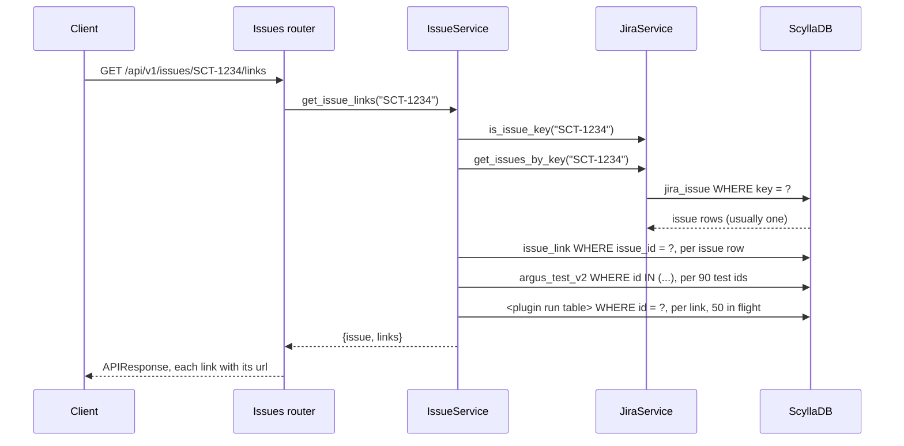
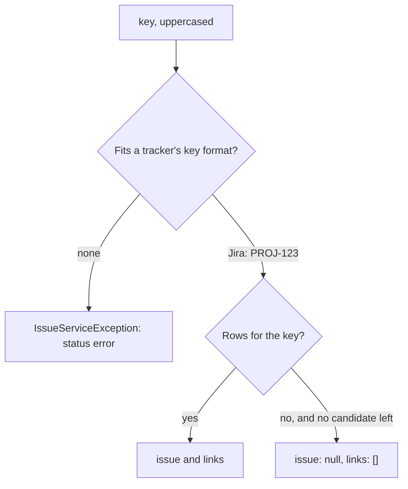

# ARGUS-209 — List the test runs linked to a Jira issue

## Overview

`GET /api/v1/issues/{key}/links` returns a Jira issue and the test runs linked
to it. `IssueService` checks the key against each tracker's key format (Jira
only today). It reads the issue rows by key and their links by issue id, each
through a new secondary index. It resolves every link to its test and its run,
newest first, and the router adds the build page URL of each run. A
well-formed key that Argus does not hold returns an empty result. A value that
is not an issue key is rejected.

## Constraints

- `issue_link` and `jira_issue` grow without a bound, so the read restricts an
  indexed column on each and uses no `allow_filtering()`. It filters only on
  that indexed column, with no `LIMIT`.
- The read never calls Jira. It answers from the copy Argus keeps, so a Jira
  outage or rate limit cannot fail it. The issue state is as fresh as the
  periodic `refresh_stale_issues` sync.
- `issue` keeps the shape of one issue in `/issues/get`. ARGUS-210 then reuses
  the frontend `JiraSubtype` type and the Jira issue card.
- One call carries everything that ARGUS-210 and ARGUS-211 render, versions
  included. Neither needs a second request per run.
- Several `jira_issue` rows can hold the same key: `get_issue` stores a second
  row when a submitted URL ends in a slash. The read merges them.
- Four workers serve old and new code during a deploy. The schema change is
  additive, and old code never reads the new indexes.

## Design

**Components**

- Issues router: calls the service and adds the absolute run page URL to each
  link. The service holds no request object.
- `IssueService`: tries, in order, each tracker whose key format fits the key,
  and rejects a key that no tracker accepts. Then it reads the links of every
  issue row, merges them, resolves each link to its test and its run, and
  sorts.
- `JiraService`: recognizes the Jira key format and finds the issue rows by
  key.
- Models: `IssueLink` and `JiraIssue` gain one index each.
- Plugin run models: serve each run by its indexed `id`.





| Condition | Behavior |
|---|---|
| The key fits no tracker's format (Jira: `[A-Z][A-Z0-9_]*-[0-9]+`) | `IssueServiceException`; HTTP 200, `status: error` |
| The key is in lower case | Uppercased before the lookup |
| No `jira_issue` row holds the key | `{"issue": null, "links": []}` |
| The issue has no links | `{"issue": {...}, "links": []}` |
| Several rows hold the key | Links merged and deduplicated by `run_id`; `issue` is the row with the latest `added_on` |
| A link's test or run no longer exists | The link is left out |
| A database read raises | The error propagates to the HTTP 200 error envelope, as on every route |
| An index is still building after a deploy | The list can be partial; no error |

## Contracts

### Outputs

The endpoint, route name `api.testrun_api.issue_links`, behind
`api_current_user`:

```
GET /api/v1/issues/{key}/links    key: an issue key in any case, e.g. SCT-1234
```

```python
class LinkedRun(TypedDict):
    run_id: UUID
    test_id: UUID
    test_name: str
    plugin_name: str          # scylla-cluster-tests | driver-matrix-tests | generic | sirenada
    status: str               # a TestStatus value: created, running, failed, test_error, error, passed, ...
    start_time: datetime
    build_id: str
    build_number: int | None
    scylla_version: str | None
    product_version: str | None
    linked_on: datetime | None  # IssueLink.added_on; None on old rows
    url: str                  # absolute run page URL: <base>/test/<build_id>/<build_number>

class IssueLinks(TypedDict):
    issue: dict | None        # JiraIssue fields + "subtype": "jira"; None for an unknown key
    links: list[LinkedRun]    # newest start_time first
```

```json
{
  "status": "ok",
  "response": {
    "issue": {
      "id": "6f0c…", "user_id": "1d2e…", "key": "SCT-1234", "summary": "Nemesis fails to restart node",
      "state": "in progress", "project": "SCT", "permalink": "https://scylladb.atlassian.net/browse/SCT-1234",
      "labels": [{"id": 2915093381, "name": "triage", "color": "000", "description": ""}],
      "assignees": ["someone@scylladb.com"], "added_on": "2026-09-14T08:21:05.112Z", "subtype": "jira"
    },
    "links": [{
      "run_id": "a7b1…", "test_id": "93c4…", "test_name": "longevity-100gb-4h", "plugin_name": "scylla-cluster-tests",
      "status": "failed", "start_time": "2026-09-30T22:10:44.000Z", "build_id": "scylla-master/longevity/longevity-100gb-4h",
      "build_number": 412, "scylla_version": "2026.2.0~dev", "product_version": "2026.2.0~dev",
      "linked_on": "2026-10-01T07:02:13.540Z", "url": "https://argus.scylladb.com/test/scylla-master/longevity/longevity-100gb-4h/412"
    }]
  }
}
```

The schema change, applied by `sync-models`:

```sql
CREATE INDEX IF NOT EXISTS issue_link_issue_id_idx ON issue_link (issue_id);
CREATE INDEX IF NOT EXISTS jira_issue_key_idx ON jira_issue (key);
```

Consumer rules: treat `issue: null` as "Argus holds no such issue", not as an
error. Ignore unknown fields. A new tracker adds an `issue.subtype` value.

### Module API

```python
class IssueServiceException(Exception): ...

class IssueService:
    async def get_issue_links(self, key: str) -> IssueLinks: ...  # raises IssueServiceException

class JiraService:
    KEY_PATTERN: re.Pattern   # [A-Z][A-Z0-9_]*-[0-9]+
    def is_issue_key(self, key: str) -> bool: ...
    async def get_issues_by_key(self, key: str) -> list[JiraIssue]: ...
```

## Risks

| Risk | Response |
|---|---|
| The index build on a large `issue_link` in production | ScyllaDB builds it in the background. The PR says that `sync-models` must run on deploy and that the list can be partial until the build ends |
| An issue with hundreds of links costs hundreds of run reads | Each one is a single indexed read, 50 in flight. Pagination can arrive later as query parameters without a shape change |
| Each link write now updates one more index | People write links by hand, so the rate is low |
| The issue state lags Jira | It is as fresh as `refresh_stale_issues`; the docs say so |
| A second tracker's key format overlaps Jira's | Candidates run in a fixed order and the first that holds the key wins. That tracker's design decides the order |

## Deferred work

- ARGUS-210 renders this response on its page. ARGUS-211 prints it from the
  CLI.
- A second tracker: a key format and a key lookup in that tracker's service,
  added to the candidates. The route and the response shape stay.
- Pagination parameters, if issues with very many links turn out to be slow.
- A data job that merges duplicate `jira_issue` rows, and the trailing-slash
  fix in `get_issue`.

## Decisions

- The request carries the issue key alone, and the service finds the tracker
  from the key's format. The maintainer chose this over the ticket's "tracker
  plus key" wording: a caller holds the key, and a second tracker then adds a
  key format, not a route. (build)
- The lookup takes the issue key, not the internal issue id. A caller rarely
  holds the id. (spec)
- A value that fits no tracker's key format is rejected with `status: error`.
  A well-formed key that Argus does not hold returns the empty result that the
  ticket asks for. (build)
- Each run links to its build page, `/test/<build_id>/<build_number>`, with no
  fallback. A run's `build_id` is its test's `build_system_id`, and every run
  row carries a `build_number`. (build)
- The call returns every link, with no pagination. An issue links to few runs,
  and query parameters can arrive later without a shape change. (spec)
- A link whose test or run no longer exists is left out, since it has nothing
  to open. (spec)
- `IssueServiceException` is a plain service exception, like the other
  services' exceptions, so a malformed key is logged as any service error is.
  (review)
