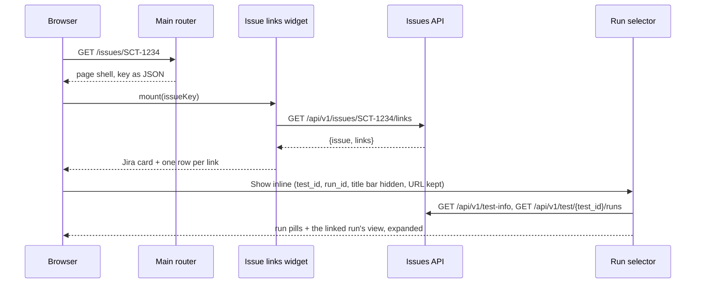
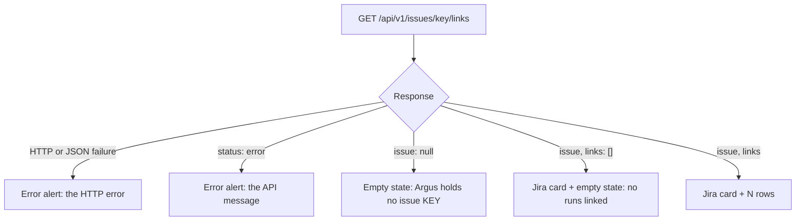

# ARGUS-210 — A page that lists the test runs linked to a Jira issue

## Overview

`GET /issues/{key}`, for example `/issues/SCT-1234`, serves a page shell that
loads a new Svelte widget. The widget calls the ARGUS-209 lookup,
`GET /api/v1/issues/{key}/links`, once. It shows the issue with the existing
Jira issue card, read only, then one row per linked run, newest first. Each
row shows the run in aligned columns, with a link to the run page
`/test/<build_id>/<build_number>` and a toggle that opens the run inline. The
inline view is the run page's own widget, the run selector and the run view,
with the selector's title bar hidden. An unknown key and a key without links
each show an empty state.

## Constraints

- The page reads the ARGUS-209 response as it is. No backend data path is
  added, and the API shape does not change.
- The key comes from the URL path, so it reaches the template and the script
  escaped.
- One request per page load. The response carries every field the rows show.
- The inline view behaves as the run page does, with its run selector, tabs
  and actions. Its run list and run data load once, without the run page's
  refresh timers; the timers inside its tabs stay. It reuses that widget
  rather than a copy.
- The run selector serves the workspace, the run pages and the standalone test
  page. Their behavior does not change.
- The page depends on the ARGUS-209 indexes, which `sync-models` creates on
  deploy. The page adds no schema change.

## Design

**Components**

- Main router: a page route behind the UI login. An anonymous visitor goes to
  the login page and returns to the issue page after the login.
- Page template: hands the key to the script as JSON and loads the page
  bundle.
- Issue links widget: fetches the lookup and renders the issue header, a count
  of the linked runs with their tests, versions and statuses, and the run list
  under a column header. Otherwise it renders the empty state or the error.
- Linked run row: renders one run in aligned columns: a status badge, the test
  with its release path and link date, the build, the start time and the
  version. Then the run page link and the inline toggle. Opening the run mounts
  the run selector, and closing it unmounts the selector.
- Run selector (`TestRuns`, existing): gains a switch that hides its title
  bar, one that stops its run views from rewriting the page URL, and one that
  turns off the refresh timers of its run list and of its run views' run
  data. The title
  bar holds the test name, the latest status, and the configure, rebuild and
  clone buttons. A run view rewrites the URL to `/tests/<plugin>/<run>/<tab>`
  on a tab change, outside the workspace.
- Jira issue card (existing): renders the header with the delete action off.
  The Jira and GitHub cards move to a two-line layout: the state, the key, the
  labels and the actions on the first line, the summary across the second.
- Status styles (existing): aborted gets its own background and button
  classes. The light theme keeps its color, and the dark theme lightens it.





| Condition | Behavior |
|---|---|
| The visitor is not logged in | Login redirect; the issue page is the return target |
| The value is not an issue key, e.g. `SCT1234` | The page renders; the widget shows the API message in an alert |
| The key is in lower case | The API uppercases it; the header shows the stored key |
| The request fails or returns no JSON | The widget shows an alert with the HTTP error |
| The inline run selector fails to load | The selector's own message, as on the run page |
| A link's run was deleted since the lookup | Open run lands on the run page's not-found redirect |

## Contracts

### Inputs

The ARGUS-209 lookup, behind the session login:

```
GET /api/v1/issues/{key}/links
  issue: key, summary, state, permalink, labels, user_id, added_on, subtype
  links: run_id, test_id, test_name, status, start_time, build_id, build_number,
         scylla_version, product_version, linked_on, url
```

### Outputs

The page, route name `main.issue_links`, behind `ui_current_user`:

```
GET /issues/{key}    key: an issue key in any case, e.g. SCT-1234   → text/html
```

The run selector gains three props. Existing callers omit them and keep the
title bar, the URL updates and the refresh timers:

```ts
// frontend/WorkArea/TestRuns.svelte
showTitleBar?: boolean   // default true; false hides the title bar, the run pills and run view stay
updateUrl?: boolean      // default true; false keeps the page URL on a run view's tab change
autoRefresh?: boolean    // default true; false turns off the run-list and run-data refresh timers, tab timers stay

// frontend/WorkArea/TestRunDispatcher.svelte and the four plugin run views
// (TestRun, DriverMatrixTestRun, SirenadaTestRun, GenericTestRun)
updateUrl?: boolean      // default true
autoRefresh?: boolean    // default true
```

Aborted takes its own status classes wherever a status renders:

```scss
// frontend/argus.scss: $dark in the light theme, $gray-700 in the dark theme
.bg-aborted   // StatusBackgroundCSSClassMap.aborted
.btn-aborted  // StatusButtonCSSClassMap.aborted, generated by Bootstrap's button-variant
```

### Module API

```ts
// frontend/Common/IssueTypes.ts
export interface LinkedRun {
    run_id: string;
    test_id: string;
    test_name: string;
    plugin_name: string;
    status: string;
    start_time: string;
    build_id: string;
    build_number: number | null;
    scylla_version: string | null;
    product_version: string | null;
    linked_on: string | null;
    url: string;
}

export interface IssueLinks {
    issue: Omit<JiraSubtype, "links" | "event_id"> | null;
    links: LinkedRun[];
}
```

```js
// frontend/Common/TestStatus.js
export const StatusBadgeCSSClassMap   // status → a background and text class pair, for a badge
```

```ts
// frontend/IssueLinks/IssueLinks.svelte
interface Props { issueKey: string }

// frontend/IssueLinks/LinkedRun.svelte
interface Props { link: LinkedRun }
```

## Risks

| Risk | Response |
|---|---|
| One run expanded in two inline views of the same test repeats the element ids its run view keys by run id | It takes two rows of one test open and the same run picked in both. The selectors' ignore-runs dialogs bind their own element and do not collide |
| An open inline view shows the run list and the run data as they were when the view opened | Closing and reopening the view, or reloading the page, loads them again. The tabs keep their own timers: Events every 60 s until the run finishes, Discussion every 60 s, and the Pytest subtest tab of a generic run every 5 s while the window has focus |
| An issue with hundreds of links renders hundreds of rows | One request, plain rows, no run view until a row opens. Pagination follows the API when it gains parameters |
| The new props change shared widgets | The defaults keep the title bar, the URL updates and the refresh timers; tests cover both values |
| The aborted color changes on every page that shows a status | The light theme keeps `$dark`. Only the dark theme changes, to a gray its backgrounds do not hide |
| The card rework changes the issue cards on the run's issue tab and in the aggregated lists | Same content and actions; checked in both themes and at 600 px |

## Deferred work

- Links to this page from the rest of Argus, such as the key on the Jira issue
  card and the run's issue tab. The route name and the URL stay as designed.
- A second tracker. The URL stays `/issues/{key}`, the API picks the tracker
  from the key, and the issue card already renders by `subtype`.
- Pagination, when the lookup gains parameters.
- The Jira write-back of ARGUS-220 can point an issue to this URL.
- One shared layout for the Jira and GitHub issue cards, which duplicate each
  other.
- Validation and enforcement of `build_number` on every run. The run page link
  of each row is built from it.

## Decisions

- The page URL carries the issue key alone, `/issues/{key}`, as the ARGUS-209
  lookup does. A second tracker then adds a key format, not a route. (spec)
- The inline view mounts the run page's widget, the run selector, with its
  title bar hidden, since the row's summary line already names the run. (spec)
- The page route does not check the key. The API holds the key rule, and the
  widget shows its message, so the rule lives in one place. (spec)
- The header reuses the Jira issue card with deletion off. The page lists
  links and does not edit them. (spec)
- An unknown key and a known key without links show different empty states,
  so the reader learns whether Argus holds the issue at all. (spec)
- Each row links to the run through the `url` of the response, so the page
  builds no run URL of its own. (spec)
- The widget fetches once and does not poll. The inline views load their run
  list and run data once too: the run selector and its run views keep those
  refresh timers off. The timers inside the tabs stay. (review)
- Each row shows the run in aligned columns under a header, and its status as
  a text badge, so a reader scans many runs and does not rely on color.
  (build)
- The heading counts the tests, the versions and the statuses of the linked
  runs: the reach the ticket asks about. (build)
- The inline view keeps the page URL. A run view's tab change rewrote it to the
  run's own URL, so a refresh left the issue page. (build)
- Aborted gets its own status classes. The Bootstrap dark color matched the
  dark theme's backgrounds and hid the status. (build)
- The Jira and GitHub issue cards drop their fixed column widths for a
  two-line layout. It fits narrow widths and gives the summary the full
  width. It lands in a commit of its own. (build)
- The run selector's ignore-runs dialog binds its own element instead of an
  id keyed by the test, so two inline selectors of one test each open their
  own dialog. (review)
- From the `lg` breakpoint, the status and actions columns take fixed widths
  that fit the widest status badge and the button group, and the test column
  takes the rest. Grid fractions left both too narrow below 1400 px. (review)
