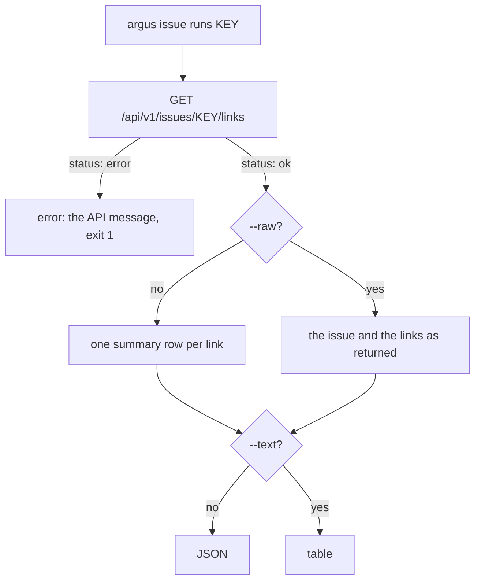

# ARGUS-211 — List the test runs linked to an issue from the CLI

## Overview

`argus issue runs SCT-1234` calls the ARGUS-209 lookup,
`GET /api/v1/issues/{key}/links`, once. By default it prints one summary row
per linked run, newest first: run id, test name, build, version, status, start
time and the Argus run link. JSON output is the array of those rows and
mirrors the `--text` table column for column, as `planner list`, `view list`
and `my-jobs` do. `--raw` prints the issue and every link field as the API
returns them. A key that Argus does not hold, or that has no links, prints an
empty list and exits 0.

## Constraints

- The command reads the ARGUS-209 response as it is. It adds no backend
  change and sends one request per call.
- The default JSON carries exactly the text columns, as in every other CLI
  list command.
- A run row reuses the JSON names of the `my-jobs` row (`id`, `build_id`,
  `build_number`, `version`, `status`, `argus_url`), so a script reads the run
  rows of either command the same way.
- The server owns the key format rule. The CLI trims the key and sends it,
  and the server uppercases it or rejects it.
- The lookup is never cached. A link added a minute ago shows up.

## Design

**Components**

- `issue runs` command: reads the key argument and the `--raw` flag, calls
  the issue service, and hands the rows or the raw response to the outputter.
- Issue service (CLI): sends the lookup with the key path-escaped and decodes
  the envelope into the response type.
- Response models: decode the response, and map each link to a run summary
  row in the order the server sent.
- Outputter (existing): JSON by default, a table with `--text`.



| Condition | Behavior |
|---|---|
| The key has linked runs | One row per run, newest first, exit 0 |
| The key is unknown, or has no links | `[]`, or a table with no rows under `--text`, exit 0 |
| The key is in lower case | The server uppercases it, and the result is the same |
| The key fits no tracker's format (`SCT1234`) | The API message is printed, exit 1 |
| The API is unreachable or rejects the credentials | As every command: the error, exit 1 |
| The key has surrounding whitespace | Trimmed before the lookup |
| No key argument, more than one, or a key that is blank, `.` or `..` | Cobra usage error, exit 1 |
| `--raw` with an unknown key | `{"issue": null, "links": []}`, or the rows `issue null` and `links []` under `--text`, exit 0 |

## Contracts

### Inputs

```
GET /api/v1/issues/{key}/links    # ARGUS-209, behind the API token
  response.issue    # JiraIssue fields + "subtype"; null for an unknown key
  response.links[]  # run_id, test_id, test_name, plugin_name, status, start_time, build_id,
                    # build_number, scylla_version, product_version, linked_on, url
```

### Outputs

The command, listed in `argus issue --help`:

```
argus issue runs <issue-key> [--raw] [--text]
```

The default row, one per linked run, newest first:

```go
type IssueRunSummary struct {
	ID          string `json:"id"`           // links[].run_id
	Test        string `json:"test"`         // links[].test_name
	BuildID     string `json:"build_id"`
	BuildNumber *int   `json:"build_number"`
	Version     string `json:"version"`      // links[].scylla_version, else links[].product_version
	Status      string `json:"status"`
	StartTime   string `json:"start_time"`
	ArgusURL    string `json:"argus_url"`    // links[].url
}
```

```
$ argus issue runs SCT-1234
[{"id": "a7b1…", "test": "longevity-100gb-4h", "build_id": "scylla-master/longevity/longevity-100gb-4h",
  "build_number": 412, "version": "2026.2.0~dev", "status": "failed", "start_time": "2026-09-30T22:10:44.000Z",
  "argus_url": "https://argus.scylladb.com/test/scylla-master/longevity/longevity-100gb-4h/412"}]

$ argus issue runs SCT-1234 --text
Id | Test | Build Id | Build Number | Version | Status | Start Time | Argus URL
```

`--raw` prints the response payload, `{"issue": {...}, "links": [...]}`,
exactly as the API sent it: every field, including one the API adds later,
with `null` and numbers as written. Under `--text` it prints a key and value
table, `issue.key`, `links.0.run_id` and so on, with `null`, `[]` and `{}` as
values.

Consumer rules: an empty array means that Argus holds no runs for the key. It
is not an error. Ignore unknown fields. A new column arrives as a new field.

### Module API

```go
package services

func NewIssueService(client *api.Client) *IssueService
func (s *IssueService) Links(ctx context.Context, key string) (models.IssueLinks, error)

package models

type IssueLinks struct {
	Links []LinkedRun `json:"links"`
}
func (l IssueLinks) Summaries() IssueRunSummaries // never nil, so JSON prints [] for no links
func (l IssueLinks) Raw() RawJSON                 // the payload exactly as the API sent it

type RawJSON []byte // JSON output as sent; text output a key and value table
```

## Risks

| Risk | Response |
|---|---|
| The run link takes its host from the request that the server saw, not from the CLI's configured URL | Gunicorn trusts the proxy headers (`forwarded_allow_ips = "*"`), so production links name the public host. The web page and the API documentation use the same link |
| An issue with hundreds of links prints a long table | The server returns every link, so the CLI prints them all. `--status` or `--limit` flags can arrive later without a change to the row shape |

## Deferred work

- A second tracker adds a key format on the server. The command takes any key
  and needs no change.
- Filter flags (`--status`, `--limit`) if long lists turn out to be common.

## Decisions

- The command is `argus issue runs <KEY>`, under the root `issue` group next
  to `add` and `list`, with the key as its one argument. A caller holds the
  key alone, and the group already holds the issue commands. (spec)
- The default output is one summary row per run, and the JSON mirrors the
  table, as in `planner list`, `view list` and `my-jobs`. (spec)
- `--raw` prints the response payload exactly as the API sent it, and its
  text table shows `null` and empty lists. A script that needs the issue or
  `linked_on` takes it from there, and a field the API adds later reaches it
  without a CLI release. (review)
- The run link is the API's `url`, passed through. The server already builds
  the build page link, and the CLI repeats no rule. (spec)
- `version` is the run's `scylla_version`, or its `product_version` when the
  run reports no Scylla version. Some runs report only the product version,
  and their row would show no version. (build)
- The CLI trims the key and checks only that it is not empty, `.` or `..`.
  The server holds the format rule, and its error message reaches the user
  unchanged. The three rejected keys cannot form the path segment of the
  lookup and would reach the server as a bare 404. (review)
