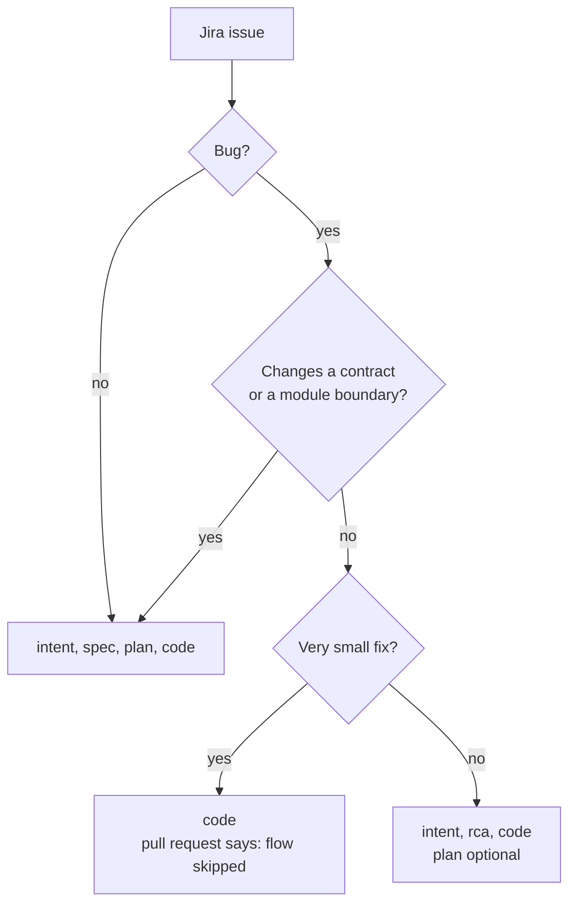

# ARGUS-230 — Port the zeus SDLC improvements

**Date**: 2026-09-15

## Design drivers

- Argus and zeus share one flow. A sentence that differs between the two
  repositories needs a reason, and the Argus-specific text is the only reason.
- A template steers by what it asks for. Each section makes the wrong content
  awkward to place, so a file list has no natural home in a spec.
- A bug fix needs a record of the cause and of the chosen fix. A design review
  adds little to it, so the path must be lighter than the spec path.
- The rejected approaches in an `rca.md` are the decision record. The
  no-history rule must not remove them.
- This task is the first `tasks/<KEY>/` in Argus, so its own artifacts show
  the new shape before the templates land.

## Goals

- The Argus spec, plan, and new rca templates match the zeus text at the merge
  of scylladb/zeus pull request 193.
- A spec names its design drivers, shows one Mermaid diagram per flow, and
  names its contracts. File lists, internals, and tests live in `plan.md`.
- A Jira Bug produces `intent.md`, `rca.md`, and code. `plan.md` is optional.
- A bug fix that changes a contract or a module boundary writes `spec.md`.
- A very small fix may skip the flow. The pull request description says so.
- Pass 3 of the review checks the contracts, the rca, and the skip statement.
- `CLAUDE.md` and `docs/INDEX.md` state the new artifacts and gates.

## Non-goals

- No change to `tasks/templates/intent.md`.
- No change to the six stages, their approvers, or the commit order of the
  feature path.
- No change to the Argus-specific text: the `Fixes ARGUS-<n>` line, the
  `docs/plans/` paragraph, the `AGENTS.md` line, and the eight checks under
  "Before you report a finding" in the review policy.
- No tool checks the sections, the length, or the path of a task.
- No test for the content of a document.

## Design

Seven documents take part. The spec template defines the shape of a spec. The
plan template takes the detail the spec drops. A new rca template defines the
bug fix artifact. The flow document says what a spec is for, adds the bug fix
path, and names the path decision. The review policy reads `spec.md` or
`rca.md`, whichever the task has, and checks that a skipped flow is stated.
`CLAUDE.md` keeps an agent session on the gates. The index summarizes the flow
document and the review policy.



Decision rules. The engineer who runs the session decides "changes a contract
or a module boundary" and "very small". The boundary question comes first on
every path, so a boundary change never skips the flow and never writes an
rca. The rca path keeps the commit order: intent, then rca, then code. A bug
fix on the spike path writes `intent.md` and `rca.md` from the code that
already works.

Port rule. Each hunk of the three zeus pull requests lands in the Argus file
with the same path. Where the Argus file carries a sentence zeus lacks, the
sentence stays and the hunk goes around it.

## Contracts

### Inputs

scylladb/zeus at the merge of pull request 193: `tasks/templates/spec.md`,
`tasks/templates/plan.md`, `tasks/templates/rca.md`, and the hunks of pull
requests 190, 191 and 193 in `CLAUDE.md`, `docs/INDEX.md`,
`docs/standards/development-flow.md`, and `docs/standards/REVIEW.md`.

### Outputs

`tasks/templates/rca.md`, new, the zeus text verbatim. Its sections:

```markdown
## Root cause
## Approaches
## Regression test
## Risks
```

and a footer that names the two path rules.

`tasks/templates/spec.md`, the zeus text verbatim. Its sections: Design
drivers, Goals, Non-goals, Design, Contracts with Inputs, Outputs and Module
API, Risks, Deferred work, and a footer that stays in every spec.

`tasks/templates/plan.md`, the zeus text verbatim: the header names `rca.md`
for a bug fix, and each task block carries an `Internals` line with its omit
clause.

`docs/standards/development-flow.md`: the stage table names `rca.md` for a bug
at Stage 2. Stage 2 states what carries the design decision and what bounds
the scope. Stage 3 and the spike path name the split between spec and plan. A
"The bug fix path" section follows the spike path.

`docs/standards/REVIEW.md` Pass 3: read `spec.md`, or `rca.md` for a bug fix.
Check the contracts, the selected approach, the regression test, and the skip
statement.

`CLAUDE.md` Task Artifacts: `rca.md` in the artifact list, the four gates with
the rca, the spec and plan split, the bug fix path, and the spike variant for
a bug.

`docs/INDEX.md`: the Development Flow and Review Policy summaries name the
design review spec, the bug fix path, and the skip rule. The Argus sentences
about the Svelte 5 and CSS checks stay.

### Module API

None.

## Risks

| Risk | Response |
|---|---|
| A zeus hunk overwrites an Argus-specific sentence. | The Non-goals name each one. Pass 3 reads the diff against that list. |
| This spec predates the template it introduces, so a reader compares it to the old template. | The spec follows the new shape. The plan commits the template first. |
| A feature filed as a Bug takes the rca path and gets no design review. | The contract-or-boundary rule sends it to a spec. |
| The skip becomes the default. | The pull request must state it, and a maintainer approves the merge with that line in view. |

## Deferred work

- A check on the sections and the length of a spec or an rca, in a pre-commit
  hook.
- Several specs under one intent, each with its own plan and pull request.

---

Files, internal functions, tests, and line numbers go to `plan.md`. On the
spike path the code diff carries them, and the spec keeps this shape. A spec
near 150 lines, diagrams included, reads in one sitting. Above that, consider
a split and propose it in the spec. This footer stays in every spec.
