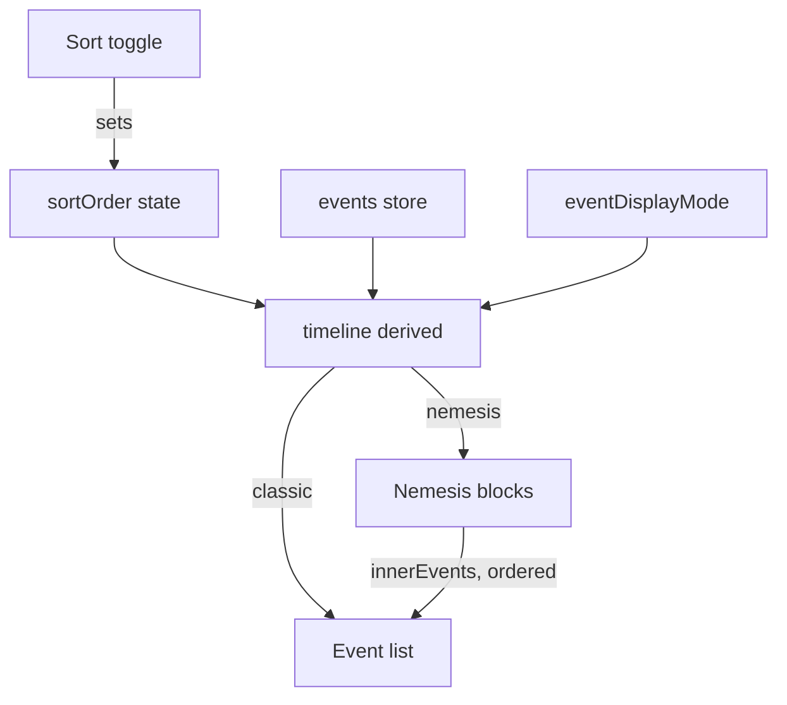

# ARGUS-236 — Events tab sort order

**Date**: 2026-09-18

## Design drivers

- The default view must stay byte-identical to today's. A user who never
  presses the button sees no change in the classic timeline.
- The ordering decision stays in one function. Two sort sites that can drift
  apart is what produced the unsorted `innerEvents` in the first place.
- The `events` store keeps its fetch order. `fetchEvents` reads its `before`
  cursor from `old[0].ts`, so a reordered store would corrupt pagination the
  day that cursor path is switched on.
- No backend change. The read path is shared with the Go CLI and the client.
- A live run refreshes every 60 seconds. Newest-first prepends, so the feature
  must not move the ground under a reader.

## Goals

- A user can flip the event timeline between oldest-first and newest-first.
- The order holds in both display modes and inside a nemesis block.
- Nested nemesis events become chronological rather than severity-grouped.

## Non-goals

- The Events (Legacy) tab.
- Persisting the choice across page loads.
- Sorting by anything other than the event timestamp.
- Changing which events are fetched, or how many.

## Design

Three components take part, all in the frontend.

- `SctEvents.svelte` owns the `sortOrder` state, renders the toggle, and
  applies the order inside `createTimeline`.
- `SctNemesis.svelte` renders the already-ordered `innerEvents` it is handed.
  It makes no ordering decision.
- `SctEvent.svelte` is untouched.



`createTimeline` builds one comparator from `sortOrder` and applies it at every
site that orders events: the classic branch, the nemesis branch, and the nested
`innerEvents` that the nemesis branch assigns. `timeline` stays a `$derived`
over `nemeses`, `events`, `eventDisplayMode` and `sortOrder`, so the 60-second
refresh re-sorts the full set and a newly arrived event lands in the position
the current order demands. No append path and no incremental insert exists.

The toggle sits as the first child of the existing severity-filter row, which
is `d-flex justify-content-end`. Carrying `me-auto` pins it left and leaves the
severity buttons where they are, including when they wrap.

| Condition | Behavior |
|---|---|
| Newest-first, refresh prepends, reader scrolled into the list | Hold the reader's anchor: offset `scrollTop` by the height the list gained |
| Newest-first, refresh prepends, reader at the top | Leave `scrollTop` at 0 so new events arrive in view |
| Oldest-first, refresh appends | Do not touch `scrollTop`; today's behavior |
| Order toggled by the user | Reset `scrollTop` to 0; the old offset means nothing in the new order |
| Run reaches a terminal status | The refresh timer is already cleared; no scroll handling runs |

Two events of the same severity sharing a millisecond currently collide on
`TimelineEvent.id`, which is `type-severity-ts`. That id gains the event's own
identity so it is unique, because the timeline loop must become keyed for the
reorder to re-bind `eventMap` correctly, and a keyed loop with a duplicate key
throws. The same collision is why `remainder` can drop an event the nemesis
branch did not consume; the fix removes that too.

## Contracts

### Inputs

`None`. No new endpoint, and no new field on an existing one.

### Outputs

`None`. No data shape, no schema, no stored artifact.

### Module API

`SctEvents.svelte` exports from its `<script module>` block. `createTimeline`
moves there so the ordering is testable without mounting the component, and
takes the run end time as a parameter rather than closing over `testRun`.

```ts
export type SortOrder = "oldest" | "newest";

export function createTimeline(
    nemeses: NemesisInfo[],
    events: EventStore,
    timelineMode: "nemesis" | "classic",
    sortOrder: SortOrder,
    endTime: string,
): TimelineEvent[];
```

`TimelineEvent.id` keeps its type but changes shape, from
`${type}-${severity}-${ts}` to that prefix plus the event's `event_id`, or a
nemesis's `name` and `start_time`. `SctNemesis.svelte` composes `eventMap` keys
from this id and reads them back with a substring match, so the change is
contained.

## Risks

| Risk | Response |
|---|---|
| Nested nemesis events change order at the default setting, which nobody asked for | Called out in the intent, the Jira issue and the pull request body. It is a correction, not a side effect to hide |
| A keyed loop plus a changed id shape breaks the duplicate-highlight path | The id stays a prefix match for `duplicate_id`; verify `focusDuplicate` by hand on a run with duplicates |
| Scroll compensation fights the browser's own scroll anchoring | Stable keys mean nodes move rather than being recreated, which is the case anchoring handles; verify on a live run |
| Truncation hides the newest events, which newest-first surfaces | Out of scope and recorded in the issue. `SCTEvent.ts` clusters ascending and the read applies `PER PARTITION LIMIT`, so the 10000-per-severity cap drops the newest. Confirm with `DESCRIBE TABLE sct_event` before filing the follow-up |
| Conflicts with ARGUS-193, which edits the same module block | Linked in Jira; whichever lands first, the other rebases |

## Deferred work

ARGUS-193 adds a per-user display preference to this component, stored in
`localStorage`. When it lands, the sort order should become one more key under
that mechanism rather than a second one. This design keeps `sortOrder` a plain
piece of component state with a single writer so that move stays cheap.

---

Files, internal functions, tests, and line numbers go to `plan.md`. On the
spike path the code diff carries them, and the spec keeps this shape. A spec
near 150 lines, diagrams included, reads in one sitting. Above that, consider
a split and propose it in the spec. This footer stays in every spec.
