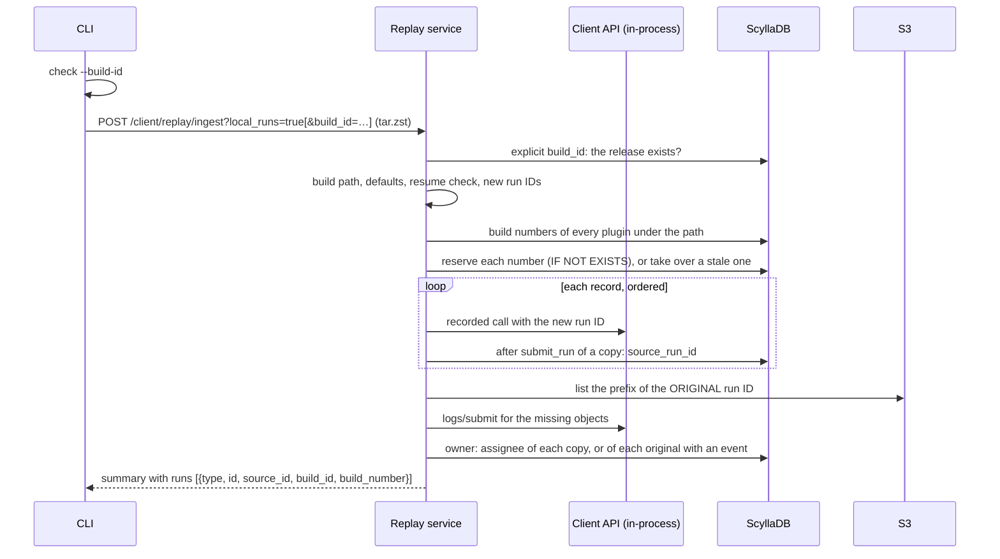

# ARGUS-252 — Replay a log into a chosen build path as a new run owned by the caller

## Overview

A replay into a build path makes a new run: each run in the archive gets a
new run ID and the next free build number under the path, and its
`submit_run` is filed under the path. The path is `build_id`, or, for one
local run when the request sends `local_runs`, `local-runs/<caller
username>/<job>`. The CLI sends `local_runs` unless the user gives
`--keep-run`, so every other client replays as before. The copy belongs to
the caller, records its source run in a new `source_run_id` column, and its
page links to the source. `resume_run_id` finishes a failed replay in the run
it made. The summary lists each run with both IDs and its build, and the CLI
prints a link per run.

## Constraints

- The archive and the recorded S3 objects stay as they are. A copy keeps its
  logs, which live under the original run ID in S3.
- A Jenkins run, and any request without the new parameters, replays as
  today, so an outage recovery restores the original runs.
- The local runs of a user are easy to find: one release, one group per user,
  one test per job.
- A replay adds nothing to a curated release unless the caller asks.
- The schema change is additive. Old code and new code run side by side
  during the deployment.

## Design

- **CLI** checks the form of `--build-id` before the upload, sends the flags,
  and prints the summary and one line per run.
- **Replay controller** passes the flags, the caller, and `BASE_URL`.
- **Replay service** picks the build path, resolves the defaults, checks a
  resume, retargets and numbers the runs, dispatches the records through the
  in-process client, back-fills logs, and assigns the owner.
- **Test run service** changes the assignee of a run that is not a copy, and
  writes the assignee-change event.
- **`replay_build_number_v1`** reserves build numbers.
- **Run page** of every plugin shows "Replayed from": a link when
  `/api/v1/run/<id>/type` finds the source, "(not in Argus)" when it does
  not, and the plain ID while it is unknown.



| Archive | `build_id` | `local_runs` | Build path |
|---|---|---|---|
| Any | given | any | `build_id` |
| One run, `submit_run` with no build URL | absent | `true` | `local-runs/<caller>/<job>` |
| Any other | absent | any | None: runs keep their recorded paths and IDs |

`<job>` is the first SCT config file without its directory and extension,
such as `longevity-100gb-4h`, else the last name of the recorded path, else
`local-run`. Names keep `A-Z a-z 0-9 . _ -`. Any other character becomes
`-`.

| Default when absent | Explicit `build_id` | `local-runs` default | No build path |
|---|---|---|---|
| `as_me` | `true` | `true` | `false` |
| `create_missing_tests` | `false` | `true` | `false` |

An explicit `build_id` must name a release that exists. The `local-runs`
default creates its release, group and test, so it works on an instance that
has none. The service resolves the defaults, because only the archive tells
whether a run is local.

**Build ID.** Two or more names split by `/`, none empty, none with
whitespace, and an optional `#<n>`: ASCII digits with no leading zero. The
first name is the release, the last the test, the rest the group.

**Numbers.** One sequence per path across every plugin, because
`/test/<path>/<n>` resolves one run. Without `#<n>`, a run takes the next
number above the highest one that a run holds. Before dispatch the service
reserves the number with `INSERT … IF NOT EXISTS`. When another replay holds
it, the service takes it over if the reservation is older than ten minutes,
since that replay failed, and moves to the next number otherwise. A given
`#<n>` that a run holds, or that a recent reservation holds, fails the
request. A dry run reserves nothing. Reservations expire after seven days.

**Retarget.** Every string in `location_params` or `body` equal to an old run
ID becomes the new ID. A string that only contains it, such as an S3 link,
stays. `submit_run` gets the path and the build URL under its plugin's keys:

| Plugin | Path key | URL key |
|---|---|---|
| SCT, driver-matrix | `job_name` | `job_url` |
| generic | `build_id` | `build_url` |
| sirenada | `build_id` | `build_job_url` |

The build URL is `<BASE_URL>/test/<path>/<n>/`, or `/test/<path>/<n>/`
without `BASE_URL`, never a URL from the request's `Host` header. Every
plugin and view reads the build number from it, and it opens the run. A test
entity that a copy creates takes no build URL.

**Writes.** The build number and the copy's `started_by` land with
`submit_run`. `source_run_id` is saved right after `submit_run` succeeds, so
a replay that stops part way can resume. The assignee goes last, after the
log back-fill, because `update_product_version` can set it from the
schedule. An original run gets only its assignee, through the test run
service, and only when it differs from the owner.

**Resume.** Needs a build path and an archive with one run. The run must
exist with `source_run_id` equal to the recorded ID and `build_id` equal to
the path, and a given `#<n>` must equal its number. The replay skips
`submit_run`, since the sirenada plugin appends the results of a second one.

| Condition | Behavior |
|---|---|
| Bad `build_id` or `#<n>`, missing release, bad resume, unknown run type, `#<n>` taken | `DataValidationError` before any dispatch |
| Missing test with `create_missing_tests=false` | `submit_run` fails with the existing diagnosis |
| `submit_run` of a run fails | No `source_run_id` and no assignee for it. The summary holds that error |
| A save of the source or the owner fails, or a copy names no run type | A `stamp_run` error for that run. The replay continues |
| `dry_run` | Every check and the numbering. No dispatch, no reservation, no save |

## Contracts

### Outputs

```sql
ALTER TABLE <plugin run table> ADD source_run_id uuid;

CREATE TABLE replay_build_number_v1 (
    build_id text, build_number int, run_id uuid, reserved_at timestamp,
    PRIMARY KEY (build_id, build_number)
);
-- reserve:   INSERT … IF NOT EXISTS USING TTL 604800
-- take over: UPDATE … SET run_id = ?, reserved_at = ? … IF run_id = <holder>
```

```
POST /api/v1/client/replay/ingest
  ?dry_run=<bool>&backfill_logs=<bool>          # existing
  &create_missing_tests=<bool>                  # default: see the table above
  &build_id=<release/…/test>[#<n>]              # new
  &as_me=<bool>                                 # new, default: see the table above
  &resume_run_id=<uuid>                         # new, needs a build path
  &local_runs=<bool>                            # new, default false; the CLI sends true
```

```json
{"status": "ok", "response": {
  "total": 83, "processed": 83, "succeeded": 83, "failed": 0,
  "skipped_no_replay": 0, "backfilled_logs": 0,
  "errors": [{"ts": 0, "endpoint": "stamp_run", "error": "run <id>: …"}],
  "runs": [{"type": "scylla-cluster-tests", "id": "<new id>", "source_id": "<recorded id>",
            "build_id": "<path>", "build_number": 1}]}}
```

`build_id` and `build_number` are `null` without a build path. The run JSON
of the existing run endpoints carries `source_run_id`.

```
argus run replay (--file <path>… | --dir <dir>) [--build-id <path>[#<n>]] [--resume <id>]
                 [--keep-run] [--as-me[=false]] [--create-missing-tests[=false]] …
Run <source_id> -> <id> (<path>#<n>): <base>/tests/<type>/<id>
Run <source_id> would replay as (<path>#<n>)          # --dry-run
```

## Risks

| Risk | Response |
|---|---|
| A body string equals the run ID but means the original run | None seen in SCT logs. The original run stays untouched |
| A resume repeats a middle record that appends | SCT events and resources land on the same row, and sirenada's `submit_run` is skipped. The summary shows each record |
| A replay into a shared path takes the run over, since `as_me` is on | `--as-me=false` |
| A replay stops between `submit_run` and the `source_run_id` save | One save wide. The run cannot resume, and a new replay makes the next build |
| A replay holds a reservation longer than ten minutes before `submit_run` | `submit_run` is ordered first, seconds after the reservation |

## Decisions

- The server applies the overrides. Only it knows the caller and the new run
  IDs. (spec)
- A replay into a build path makes a new run ID, unless it resumes its own
  copy. SCT `submit_run` keeps an existing run. (spec)
- `as_me` is separate from `build_id`, so a user can own a replay without
  moving it. (build)
- `as_me` is on for a replay into a build path, which is the caller's copy.
  (spec)
- The CLI checks `--build-id` before the upload, so a typo does not cost the
  upload. (spec)
- `source_run_id` is a column applied with `sync-models`, so the run page can
  link the copy to the source. (spec)
- The summary returns the recorded run ID next to the new one. (spec)
- The CLI sends a flag only when the user sets it. (build)
- The retarget replaces whole-value matches only, so S3 links still reach
  the recorded objects. (build)
- One local run goes to `local-runs/<caller>/<job>`: a local run records
  `local_run`, which files it nowhere useful. (review)
- The job name is the first SCT config file, the same for every run of a
  test, so its builds count up. (build)
- The CLI asks for the `local-runs` default with `local_runs`, so an older
  client keeps its replay. `--keep-run` turns it off. (review)
- Only the `local-runs` default creates folders by default. An explicit
  `build_id` needs an existing release and creates a group or test only on
  request, so a replay adds nothing to a curated release by mistake.
  (review)
- A copy takes the next free number, or `#<n>`, so its
  `/test/<path>/<n>` link names one run. (review)
- Numbers are reserved with a conditional insert, since ScyllaDB has no
  unique constraint. A reservation older than ten minutes with no run is
  taken over, so a failed replay does not block its number. (review)
- The build URL is the copy's own Argus link from `BASE_URL`, never from the
  `Host` header, since views parse the number from the URL. (review)
- `source_run_id` is saved right after `submit_run`, so a replay that stops
  part way can resume. (review)
- A resume skips `submit_run`, since sirenada appends a second one's results.
  (review)
- Without a build path, `as_me` changes only the assignee, through the
  service that writes the event. The original starter is history. (review)
- The retarget writes the path under each plugin's keys. Generic and
  sirenada read `build_id`. (review)
