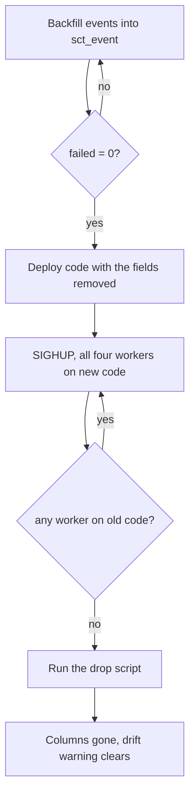

# ARGUS-56 — move SCT events off the run row and drop the legacy columns

**Date**: 2026-09-22

## Design drivers

- Four gunicorn workers reload on SIGHUP, so old and new code read and write
  `sct_test_run` at the same time for the length of a deploy.
- coodie's `save()` writes every declared model field, so the model and the
  schema cannot change in the same step.
- No SCT client may see a failure. The client raises on any response whose body
  is not `status: "ok"`, and this application answers an unhandled error with
  HTTP 200 and `status: "error"`.
- The backfill is one-way. Dropping `events` before it completes destroys the
  only copy.
- No new table and no new index. `sct_event`, `sct_nemesis` and `sct_resource`
  already exist and already serve every read and write.

## Goals

- Every run's events are readable from `sct_event`, including runs written
  before the table existed.
- `sct_test_run` no longer carries `events`, `nemesis_data` or
  `allocated_resources`.
- The model fields and the code that served them are gone, along with the run
  page's legacy tab and the CLI's event summary, which read that shape.
- The legacy submission endpoint answers exactly as it does today.
- The drop is re-runnable and refuses to run out of order.

## Non-goals

- Retiring the argusAI v1 embedding worker. It reads the legacy column and is
  no longer the running process.
- Rebuilding the CLI's event summary from `sct_event`. The row goes; restoring
  it is a follow-up.
- `DROP TYPE` for the user-defined types that stop being used.
- Re-parsing event message text. Messages move across unchanged.
- Restoring the three keys to `/api/v1/client/.../run_data`, which dumps the
  model without the `get_run_response` overrides.

## Design

Three components change: the `SCTTestRun` model, the `sct_test_run` schema, and
the run page's legacy tab. Nothing in the write path touches the three columns
already — nemesis and resource submission write only to the new tables, and the
legacy event endpoint writes nothing.

The order is the design. The schema change and the code change cannot land
together, because a worker running the old code against the new schema fails on
every write.



A read survives either order: an unrestricted `find()` selects `*`, and coodie
builds the document with `model_construct`, which discards row keys the model
does not declare. Only a write is ordered.

The backfill writes a run's events as byte-budgeted chunks, executed serially.
A chunk goes out as one batch; a chunk holding a single event goes out as a
plain `INSERT`. That split matters because an event is not bounded in size —
a gemini event runs past 1 MB — and a batch is bounded twice by the server,
at `batch_size_warn_threshold_in_kb` and `batch_size_fail_threshold_in_kb`.
A lone `INSERT` is bound by neither, only by `max_mutation_size`, so the one
shape the batch path cannot carry is exactly the shape that does not need it.

A run is the unit of recovery. Its in-flight id sits in the state file beside
the paging state, so an interrupted run's partial writes are purged and the
run is migrated again rather than left half-written.

| Condition | Behavior |
|---|---|
| `sct_event` holds no rows | The drop script refuses and exits non-zero |
| A column is already gone | The script introspects first, so the drop is a no-op |
| An old worker writes after the drop | Fails on every `save()`; the ordering above is what prevents it |
| `sync-models` runs between deploy and drop | Logs schema drift, issues no DDL, never re-adds a column |
| A single event exceeds the batch threshold | Written as its own `INSERT`, which the threshold does not bound |
| A chunk is rejected mid-run | The run's partial writes are purged, the run is reported, the scan continues |
| `events` is absent from the run response | The run page renders without the legacy tab |

## Contracts

### Inputs

The drop script reads the live column list rather than assuming one, so it is
idempotent without depending on `DROP ... IF EXISTS` support:

```
SELECT column_name FROM system_schema.columns
 WHERE keyspace_name = ? AND table_name = 'sct_test_run'
```

Its ordering guard reads one row, not a count:

```
SELECT run_id FROM sct_event LIMIT 1
```

### Outputs

The schema change, one statement per column that is still present:

```sql
ALTER TABLE argus.sct_test_run DROP allocated_resources;
ALTER TABLE argus.sct_test_run DROP nemesis_data;
ALTER TABLE argus.sct_test_run DROP events;
```

The run response keeps both surviving keys, repopulated from the new tables by
`get_run_response`, and loses `events` entirely:

```python
response["nemesis_data"] = list(SCTNemesis.find(run_id=run.id).all())
response["allocated_resources"] = list(SCTResource.find(run_id=run_id).all())
```

The legacy submission endpoint is unchanged, request and response:

```
POST /api/v1/client/sct/{run_id}/events/submit
{"schema_version": "v8",
 "events": [{"severity": "ERROR", "total_events": 12, "messages": ["..."]}]}

200 {"status": "ok", "response": "added"}
```

### Module API

Removed from `SCTTestRun`: the `allocated_resources`, `events` and
`nemesis_data` fields, and the members that only served them.

```python
def get_events_legacy(self) -> list[EventsBySeverity]: ...
def add_event(self, event_severity: str, event_message: str) -> None: ...
```

Removed from `SCTService`:

```python
@classmethod
def locate_coredumps(cls, run: SCTTestRun, events: list[EventsBySeverity]) -> list[CoredumpLink]: ...
```

Unchanged and still called by other modules: `get_events_limited`,
`get_all_events`, `get_events_by_severity`, `get_resources`, `get_nemeses`,
`get_run_response`, `submit_events`, `create_coredump_link`.

## Risks

| Risk | Response |
|---|---|
| The drop lands while a worker still runs the old code | Ordering above; confirm all four workers before running the script |
| The backfill leaves runs unmigrated | The script reports failed runs by id; check the summary before dropping |
| A frontend read of `events` is missed | Only one unguarded read exists; the narrow-viewport dropdown is guarded with it |
| A UDT is removed while a column still holds values | The driver falls back to a namedtuple and the model discards it; no error |
| `sync-models` re-adds a column | It only ever issues `ALTER TABLE ... ADD` for a declared field; the fields are gone |

## Deferred work

The `argus run get` event summary row and its `events_summary` JSON field are
removed rather than rebuilt. A follow-up builds them again from `sct_event`.

The CQL user-defined types `cloudresource_v3`, `eventsbyseverity` and the
nemesis run info type stay in the keyspace. A `DROP TYPE` is only possible once
no table references them, which this change makes true.

`argusAI/deployment/argusai_event_similarity_processor.service` still names the
v1 worker and is stale relative to what runs in production.

---

Files, internal functions, tests, and line numbers go to `plan.md`.
