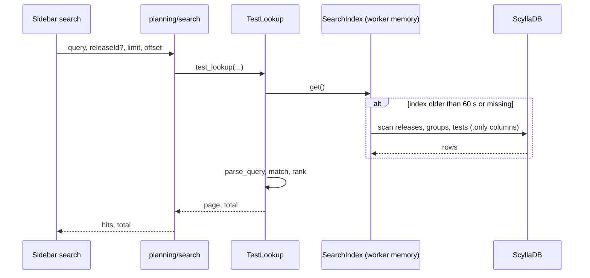
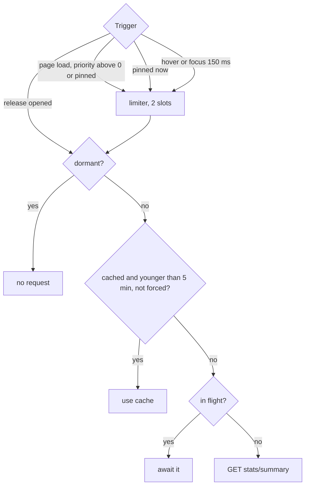
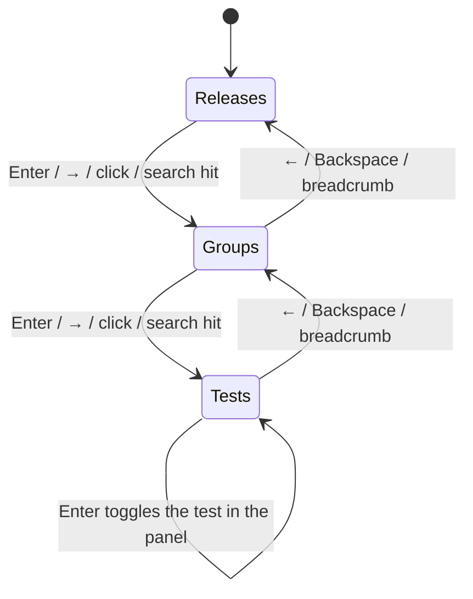

# ARGUS-81 — Rework the workspace sidebar

## Overview

The sidebar becomes a one-level list. It shows releases, then the groups of a
release, then the tests of a group, with breadcrumbs to go back up.

One search box replaces the three level filters and the panel search box. It
calls `planning/search`, which now answers from a per-worker in-memory index,
parses a richer query, and returns ranked pages.

Releases gain an admin-set `priority` that orders them on the server, and a
viewer can pin releases in the browser to list them above everything else. The
sidebar loads a compact stats summary only for prioritized, pinned, hovered and
opened releases, and re-sorts tests whenever stats change.

Below the `md` breakpoint the sidebar becomes an off-canvas drawer, opened
from a fixed bottom-left button.

## Constraints

- Four workers run with no shared cache. The search index lives in each
  worker's memory, and no new service is added.
- The released CLI parses the `planning/search` hits. The unpaged response
  keeps its shape and the fields the CLI reads.
- The URL `state` parameter keeps its format. Dashboards, Jira and GitHub
  issues link to `/workspace?state=...`.
- The stats summary reuses the snapshot key the sidebar uses today. It adds no
  snapshot rows and no extra collects.
- The `priority` column is additive. Rows written before it read back as
  `None`.
- The `AssigneeList` props stay as they are. Four other components use it.

## Design

**Release list.** `GET /api/v1/releases` sorts releases by three keys, in
order:

1. Dormant releases last.
2. Higher `priority` first.
3. `version_key(name)`. It splits the name into text and number parts. Text
   parts sort A→Z, number parts sort high to low. So `scylla-2026.3` comes
   before `scylla-2025.1`, and `manager-3.12` comes before `manager-3.9`.

The Jinja `/releases` page uses the same service, so it gets the same order.

The sidebar then lifts the releases this viewer pinned above all others, in
server order. A pin toggle sits beside each release row. The pins live in the
browser's `localStorage`; when storage is blocked they last for the page.

**Search.** `TestLookup` keeps one `SearchIndex` per worker. The index is
compact: one entry per release, group and test, plus parent refs and a
lowercase haystack built from `name`, `pretty_name` and `build_system_id`. A
request older than the TTL rebuilds the index. The rebuild runs once at a
time, behind a lock that belongs to the running event loop.



Ranking applies these keys in order:

1. How the first free-text term matches the display name: exact, then
   prefix, then word boundary, then substring.
2. Type: release, then group, then test.
3. Dormant last.
4. Priority, high to low.
5. `version_key`.
6. `id`, so that pages stay stable between requests.

**Stats.** The sidebar keeps one summary per release, with a 5-minute TTL. It
merges requests that are already in flight. Eager loads and hover prefetches
share a limiter of 2 concurrent requests.



**Sidebar.** The sidebar has three levels, and each level replaces the list.
Breadcrumbs and keys move between them.



A search hit drives the sidebar as follows:

| Hit type | Sidebar action |
|---|---|
| release | Enter the release. |
| group | Enter the group. |
| test | Enter its group, focus the test and open it. |
| run | Open its test and add the run. |

A hit shows the status of its test, or the status bar of its group or
release, whenever the sidebar holds that release's stats, which it always does
inside a release. A run hit shows the run's own status. The dropdown stays open
with its query after a pick, so several hits can be opened in a row, and
picking an open test or an open run again closes it; a test closes with its
last picked run. A pick moves the sidebar without
taking the focus from the search. The search scope is the current release, held while the dropdown is
open. A chip switches it to all releases.

**Ordering within a level.**
- Tests sort by status severity, then by name. The order is derived from the
  stats, so it re-sorts whenever stats arrive or are refreshed.
- Groups keep the server's name order.

**Row details.**
- When two siblings share a display name, each row also shows the raw `name`,
  muted.
- A test that never ran shows no date.

**Status indicator.** The status indicator is a 6 px bar of status segments
drawn to true proportion. Beside it are counts with icons for failed,
running and passed, plus a badge for failures that are not investigated yet.
It carries `role="img"` and a full breakdown in `aria-label`.

**Mobile.** Bootstrap `offcanvas-md` keeps the sidebar inline at `md` and
wider, and turns it into a drawer below that. The fixed bottom-left button
opens the drawer. Opening a test closes it.

**Failure behavior.**

| Condition | Behavior |
|---|---|
| The stats summary request fails | The row shows an error marker. *Refresh* retries, on the release list for every failed row. Nothing spins. |
| The groups or tests request fails | The list shows an error row with a retry button. |
| The index rebuild fails | The request fails with the API error. The next request rebuilds. |
| Query text holds regex or quote characters | They are plain text. An unbalanced quote runs to the end of the query. |
| A run hit whose test was deleted | A UUID lookup returns the run without a test name. `issue:` and `config:` leave out a run whose test is not in the index, which includes a test created in the last 60 s. |
| A query holds more than 1000 characters, 24 words and facets, or 8 `config:` values | The API answers with a validation error, and the search shows its message. |
| A query holds nothing to match, only exclusions | No hits. |
| A NULL status or investigation status in the stats or a run | Read as `created` and `not_investigated`. |
| A release is dormant | The sidebar requests no stats and shows a "dormant" badge. |

## Contracts

### Outputs

The release gains a column:

```sql
ALTER TABLE argus_release_v2 ADD priority int;   -- applied by sync-models
```

`GET /api/v1/releases` returns each release `model_dump()` with
`"priority": int | null`. A `null` means 0. The order follows the Design
section.

`POST /admin/api/v1/release/edit` accepts `"priority": int | null`, a whole
number from 0 to 2147483647, and `"pretty_name": str | null`. The server
stores a `null` priority as 0.

`GET /api/v1/planning/search` accepts these parameters:

```
query     string, required for any hit
releaseId uuid, optional
limit     int >= 1, optional   # present: ranked page, no "Add all..." row
offset    int >= 0, default 0
```

Without `limit`, the response is the same as today: the "Add all..." row,
then every hit, now ranked. In both forms `total` counts the matches, without
the "Add all..." row. The response body is:

```json
{"status": "ok", "response": {"total": 341, "hits": [
  {"id": "…", "type": "test", "name": "longevity-50gb-3days-test", "pretty_name": null,
   "build_system_id": "scylla-master/longevity/longevity-50gb-3days-test",
   "enabled": true, "test_metadata": {}, "release_id": "…", "group_id": "…",
   "release": {"id": "…", "name": "scylla-master", "pretty_name": null, "enabled": true,
               "priority": 10, "dormant": false},
   "group": {"id": "…", "name": "longevity", "pretty_name": "Cluster - Longevity Tests",
             "enabled": true}}]}}
```

A hit no longer carries `description`, `assignee`, `build_system_url`,
`plugin_name` or `plugin_subtype`. Neither the CLI nor any component reads
them. The run hit of a UUID lookup keeps its current shape. `issue:` and
`config:` return compact run hits, newest first:

```json
{"id": "…", "type": "run", "name": "longevity-10gb-3h-gce-test#25", "pretty_name": null,
 "build_system_id": "enterprise-2023.1/longevity/longevity-10gb-3h-gce-test", "enabled": true,
 "status": "aborted", "start_time": "2026-09-30T22:10:44.000Z", "build_number": 25,
 "test_id": "…", "release_id": "…", "group_id": "…",
 "test": {"id": "…", "name": "longevity-10gb-3h-gce-test"},
 "release": {"id": "…", "name": "enterprise-2023.1", "…": "…"}, "group": {"id": "…", "name": "longevity", "…": "…"}}
```

`GET /api/v1/views/search` uses the same lookup, so its hits change the same
way.

The query grammar:

```
query   := token*            # tokens split on whitespace; "..." keeps spaces
token   := ["-"] (facet | term)
facet   := ("release" | "group" | "type" | "issue" | "config" | "status" | "istatus" | "assignee") ":" value
value   := quoted | non-space+
term    := quoted | non-space+
```

- Terms AND together. Each term is a case-insensitive substring of the
  haystack.
- A `release:` or `group:` value is a case-insensitive substring of the name or
  the pretty name. A release or group matches its own facet too. Repeating a
  facet key ORs its values. Different keys AND together.
- A leading `-` excludes the term or facet, and `-<uuid>` excludes that
  release, group, test or run. A token made only of dashes is a plain term. A
  query with nothing to match, only exclusions, returns no hits.
- A query holds at most 1000 characters, 24 words and facets, and 8 `config:`
  values.
- `status:` and `istatus:` match the start of a test's latest status and
  latest investigation status in the release stats snapshot. `assignee:`
  matches a substring of the username or full name of the latest run's
  assignee. These three need one release, from `releaseId` or a `release:`
  value that names exactly one, and then match tests only. Without one release
  the query matches nothing.
- `issue:<KEY>` returns the runs linked to that Jira issue; repeating it lists
  the runs of every key. The runs come newest first, from
  the issue links service, across releases: it ignores `releaseId`.
- `config:<name>=<value>` returns the runs whose config parameter has that
  value, case kept; a name that is the unique dotted suffix of a stored name,
  such as `backend`, stands for it. Repeating a name ORs, different names AND.
  `config:<name>` asks for the parameter to be set and needs `issue:`.
- Under `issue:` or `config:` the rest of the query narrows the runs: words,
  `release:` and `group:` match the run's test; `status:`, `istatus:` and
  `assignee:` match the run; `type:run` keeps them. `issue:` with `config:`
  narrows the issue's runs. `config:` alone inside one release narrows each
  test's last five runs from the stats snapshot, and without a release reads at
  most 500 runs of the value.
- A `http(s)://…/job/a/job/b/…` token becomes the path `a/b/…`.
- A query that is one UUID resolves a release, group or test first, then a
  run. It never returns the "Add all..." row.

`GET /api/v1/release/stats/summary?release=<name>&force=0|1` returns:

```json
{"status": "ok", "response": {
  "total": 20, "passed": 12, "failed": 3, "test_error": 0, "error": 0, "running": 1,
  "created": 0, "aborted": 0, "not_run": 4, "not_planned": 0, "to_investigate": 2,
  "groups": {"<group_id>": {"total": 5, "failed": 1, "...": 0, "to_investigate": 1,
    "tests": {"<test_id>": {"status": "failed", "investigation_status": "not_investigated",
                            "start_time": "2026-10-01T10:00:00.000Z"}}}}}}
```

A test that never ran has `"start_time": null`. A dormant release with no
snapshot returns `{"dormant": true}`. `force=1` recomputes the stats and
stores a new snapshot, the same as `stats/v2`.

### Module API

```python
# argus/backend/service/test_lookup.py
@dataclass(slots=True, frozen=True)
class ParsedQuery:
    terms: tuple[str, ...]
    excluded_terms: tuple[str, ...]
    facets: dict[str, tuple[str, ...]]
    excluded_facets: dict[str, tuple[str, ...]]
    uuid: UUID | None
    issue_keys: tuple[str, ...]
    configs: tuple[tuple[str, str | None], ...]

    def has_positive_match(self) -> bool: ...

def parse_query(query: str) -> ParsedQuery: ...

class TestLookup:
    @classmethod
    async def test_lookup(cls, query: str, release_id: UUID | str | None = None,
                          limit: int | None = None, offset: int = 0) -> tuple[list[dict], int]: ...
        # raises DataValidationError past MAX_QUERY_LENGTH, MAX_QUERY_TOKENS or MAX_CONFIG_FILTERS
    @classmethod
    def clear_index(cls) -> None: ...

# argus/backend/util/common.py
def version_key(name: str) -> tuple: ...

# argus/backend/service/stats.py
def summarize_release_stats(stats: dict) -> dict: ...
```

## Risks

| Risk | Response |
|---|---|
| The index holds about 20–30 MB per worker | Store compact slotted entries only. Measure on the dev snapshot (~42k entries). |
| Workers serve results up to 60 s old, and two pages may come from different workers | Accept it. The TTL bounds the drift. The `api_usage.md` entry states it. |
| Eager and hover fetches hit cold snapshots, which recompute the stats | Two slots, prioritized releases only, and hover after 150 ms. Measure a cold scylla-master summary. |
| The new ranking reorders results in the planner and the CLI | Exact matches and prioritized releases come first, which helps both. The fields do not change. |
| The `/test_runs` breakout page loses its search box | The page shows a shared selection. The PR body states the loss. |
| Nothing moves to the top until an admin sets `priority` | The PR body asks an admin to set scylla-master and scylla-staging after the deploy. |
| svelte-multiselect styling in the dark theme | Map its `--sms-*` variables to Bootstrap variables. Check both themes. |

## Decisions

- Release rows load stats eagerly when `priority > 0`, prefetch on hover or
  focus, and load on open. This avoids a recompute for every row scrolled
  past. (spec)
- Within the same priority, text parts sort A→Z and number parts sort newest
  first. The server does the sort, so the `/releases` page matches. (spec)
- The panel search box goes away. The sidebar search takes over run-UUID
  lookup and "open all tests in group". The release grid picker is dropped.
  (spec)
- The search covers the current release, with a chip to switch to all
  releases. (spec)
- Search caches in worker memory with a TTL, with no added middleware. (spec)
- The query parser improves within this task. (spec)
- The new search component uses svelte-multiselect.
  `ReleasePlanner/SearchBar.svelte` stays as it is for EntityReplacer. (spec)
- No backfill of `priority`. A `null` reads as 0, and admins set the
  important releases. (spec)
- The sidebar does not persist its position across page loads. Nothing asks
  for it. (spec)
- Groups keep the name order. Tests sort by status, as they do today. (spec)
- `version_key` lives in `util/common.py`. Both the release order and the
  search ranking use it, and `test_lookup` cannot import `argus_service`
  without a cycle. (build)
- `total` counts the matches only. A page needs the match count to know
  whether more pages follow, and no consumer counted the "Add all..." row.
  (build)
- A `release:` or `group:` facet also matches the release or group itself, so
  `type:group group:longevity` finds the group. (build)
- Viewers pin releases in the browser, and a pin lists the release above every
  other, admin priority included. A pin is one viewer's convenience, so it
  needs no server state. (build)
- The search stays open after a pick, so one query can open several tests.
  (build)
- `status:`, `istatus:` and `assignee:` filter by the release stats snapshot,
  so they work on one release only: every release would mean parsing every
  snapshot per query. (build)
- The status facets match a prefix, not a substring, so `istatus:investigated`
  does not match `not_investigated`. (build)
- `issue:` ignores the release scope, because an issue's runs span releases.
  (build)
- The rest of the query narrows the runs of `issue:` and `config:`, so the two
  combine with each other and with the other facets. (build)
- `config:` is release-aware: inside a release it narrows the runs the stats
  snapshot keeps, which is bounded and newest first, and outside one it caps the
  read at 500 runs, because a common value holds tens of thousands of runs in
  random order. (build)
- Search results take their status indicators from the stats the sidebar
  already holds, so the search request does no extra work for them. (build)
- A query holds at most 1000 characters, 24 words and facets, and 8 `config:`
  values, the read of `config:` values without a release stops at 500 runs in
  all, and the entity match runs in a worker thread: the review measured a
  700-value query blocking a worker for 6.5 s. (review)
- Repeating `issue:` lists the runs of every key. (review)
- A query with nothing to match returns no hits rather than the whole index.
  (review)
- `-<uuid>` excludes that entity instead of looking it up. (review)
- The admin priority is a whole number from 0 to the `int` column's maximum,
  checked in the editor and the API. (review)
