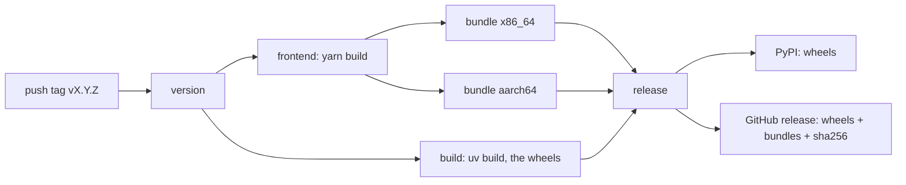

# QATOOLS-393 — Publish a release bundle the deployment can install

**Date**: 2026-09-30

## Design drivers

- The bundle layout is a contract owned by `qatools-deployments`
  (`tasks/QATOOLS-393/spec.md` there). This repository produces it; the role
  consumes it. Neither side changes it alone.
- The tree runs at any path. Nothing in it names the build directory: the
  interpreter finds its own stdlib, a relative `.pth` puts `lib/` and the tree
  root on `sys.path`, and every shim resolves its own location.
- Both architectures build on native runners, inside `manylinux_2_34`, so
  every shared object keeps a glibc 2.34 floor. Nothing runs under emulation.
- The frontend is built once, on the runner, and copied into each bundle.
  The manylinux container carries no Node, and the assets do not depend on
  the architecture.
- One release per tag. The bundle joins the release the existing PyPI job
  creates; a second release would give the role two places to look.
- A bundle that has not run is not published. The self-check runs the entry
  points from a relocated path in a container with no Python of its own.

## Goals

- `scripts/release/build-bundle.sh <version>`, run inside a manylinux
  container, assembles `dist/argus-<version>/`.
- `release.yml` builds the frontend, then one bundle per architecture, checks
  each, and attaches both, with their sha256, to the GitHub release beside the
  wheels. `workflow_dispatch` builds and uploads artifacts and publishes
  nothing.
- `docs/deployment.md` points at the deployment repository. The shell
  wrappers, `docs/config/`, and `argusAI/deployment/` leave.

## Non-goals

- Any change to what the wheel carries, or to the PyPI publication.
- The Docker image, which still builds from source.
- A bundle for macOS, or for a glibc older than 2.34.
- A change to how the application locates its configuration or its uploads.
- The role, the units, the hosts.

## Design

Three components. The **build script** turns a checkout into a relocatable
tree. The **workflow** runs it per architecture, checks the result and
publishes. The **documentation** stops describing a source build.



The build script, inside `quay.io/pypa/manylinux_2_34_<arch>`:

1. `git archive HEAD` of `argus`, `argusAI`, `argus_backend.py`,
   `gunicorn.conf.py`, `templates`, `public`, `scripts/migration`, with
   `argus/backend/tests`, `argusAI/eval`, `argusAI/tests`,
   `argusAI/deployment`, `argusAI/logs` and `storage` excluded. `git archive`
   reads the commit, so build leftovers and untracked files never ship.
2. `public/dist` copied in from the checkout, where the runner's `yarn build`
   left it. The script refuses to continue without it.
3. `uv python install --managed-python 3.13`, copied to `python/`.
4. `uv export --frozen --no-emit-project --extra web-backend --extra ai`,
   installed with `uv pip install --target lib/` against the bundled
   interpreter.
5. A `.pth` in the bundled `site-packages` with `../../../../lib` and
   `../../../..`.
6. The three shims under `bin/`, `config/` empty, `VERSION`, `COMMIT`,
   `.argus_version`.
7. Pruning: the stdlib test suite, tkinter and the Tcl/Tk runtime, headers,
   static libraries, pip, dependency test suites, debug symbols.
8. `python -m compileall -q` over `argus`, `argusAI` and `lib`: the tree is
   read-only on the host, so bytecode written here is the only bytecode there
   will be.
9. The self-check, from a copy of the tree at another path.

| Condition | Behavior |
|---|---|
| `public/dist/main.bundle.js` is missing | The script stops before the interpreter is fetched |
| The version does not match the tag | The workflow fails the bundle job; the role would refuse the tree anyway |
| A wheel for this architecture is not on PyPI | `uv pip install` fails; nothing is published |
| The self-check cannot import the application or the worker | The job fails; nothing is published |
| One architecture's job fails | The release job fails: a release with one bundle is worse than none |
| `workflow_dispatch` | Bundles are built and uploaded as artifacts for 14 days; no release is created |

## Contracts

### Inputs

```
uv.lock, pyproject.toml        # the web-backend and ai extras, resolved for CPython 3.13
package.json, yarn.lock        # yarn build -> public/dist
GITHUB_REF_NAME                # vX.Y.Z; the version is the tag without v
inputs.version                 # workflow_dispatch only
```

### Outputs

The bundle, the contract with `qatools-deployments`:

```
argus-<version>/
  VERSION  COMMIT  .argus_version      .argus_version holds the same commit as COMMIT
  argus_backend.py  gunicorn.conf.py
  argus/                               the package, tests pruned, bytecode compiled
  argusAI/                             event_similarity_processor_v2.py, utils/, prompts/
  templates/  public/                  public/dist built with NODE_ENV=production
  scripts/migration/
  config/                              empty; the role links argus_web.yaml here
  python/                              relocatable CPython 3.13, pruned
  lib/                                 every locked dependency of the web-backend and ai extras
  bin/argus-web                        cd "$root"; exec python3.13 -m gunicorn -c "$root/gunicorn.conf.py" 'argus_backend:create_app()' "$@"
  bin/argus-cli                        cd "$root"; exec python3.13 -m argus.backend.cli "$@"
  bin/argus-ai-worker                  exec python3.13 -m argusAI.event_similarity_processor_v2 "$@"
```

The assets on the release, beside the wheels:

```
argus-<version>-linux-x86_64.tar.zst
argus-<version>-linux-x86_64.tar.zst.sha256    <sha256>  argus-<version>-linux-x86_64.tar.zst
argus-<version>-linux-aarch64.tar.zst
argus-<version>-linux-aarch64.tar.zst.sha256
```

The archive roots at `argus-<version>/`. The checksum file is what
`sha256sum -c` reads, with a bare file name.

The shim shape, generated by the script:

```sh
#!/bin/sh
# Generated by scripts/release/build-bundle.sh. Do not edit.
set -eu
root=$(CDPATH= cd -- "$(dirname -- "$(readlink -f "$0")")/.." && pwd)
cd "$root"
exec "$root/python/bin/python3.13" -m gunicorn -c "$root/gunicorn.conf.py" 'argus_backend:create_app()' "$@"
```

`argus-web` and `argus-cli` change into the tree, because the application
reads `.argus_version` and writes `storage/` relative to its working
directory. `argus-ai-worker` does not: the worker's sanitizer log lands
relative to the working directory, and the unit gives it a writable one.

The self-check, run in a clean container from the relocated copy:

```
bin/argus-cli --help
python3.13 -c "import argus_backend, argusAI.event_similarity_processor_v2, cassandra, coodie, chromadb"
test -f public/dist/main.bundle.js
test -f templates/base.html.j2
test "$(cat VERSION)" = "<version>"
```

`docs/deployment.md` after the change, in full:

```markdown
# Deployment

Argus deploys from a release bundle, through the QA Tools deployment
repository: `make argus INVENTORY=<env>` in `scylladb/qatools`, see
`docs/argus.md` there. This repository publishes the bundle on every `v*`
tag (`.github/workflows/release.yml`); nothing is built on a host.
```

### Module API

None.

## Risks

| Risk | Response |
|---|---|
| The `ai` extra pulls chromadb and onnxruntime, and the bundle grows by a few hundred megabytes | Accepted: one bundle for both units keeps one release to pin and roll back |
| onnxruntime or another native wheel has no CPython 3.13 build for aarch64 | `uv pip install` fails the aarch64 job before anything is published, and the release job needs both |
| `argusAI` is a namespace package with no `__init__.py`; `-m argusAI.event_similarity_processor_v2` depends on the tree root being on `sys.path` | The `.pth` puts it there; the self-check imports the module |
| The runner's `yarn build` and the container's tree disagree on a path | The script copies `public/dist` in and refuses to run without `main.bundle.js` |
| A tag is pushed from a tree whose lock was not resolved for 3.13, or whose `pyproject.toml` gained a dependency nobody locked | `uv export --locked` fails rather than resolving anew or exporting a lock that no longer matches the project |
| A `workflow_dispatch` version is mistyped (`v1.2.3`) or carries shell metacharacters | The version job reads the input from the environment and rejects anything but `x.y.z` with an optional pre-release suffix |

## Deferred work

`gunicorn.conf.py` reading `ARGUS_BIND` from the environment, so the file
and the unit cannot disagree. The Docker image built from the bundle. A
`compileall` for the bundled stdlib, if start-up time ever matters.

---

Files, internal functions, tests, and line numbers go to `plan.md`. On the
spike path the code diff carries them, and the spec keeps this shape. A spec
near 150 lines, diagrams included, reads in one sitting. Above that, consider
a split and propose it in the spec. This footer stays in every spec.
