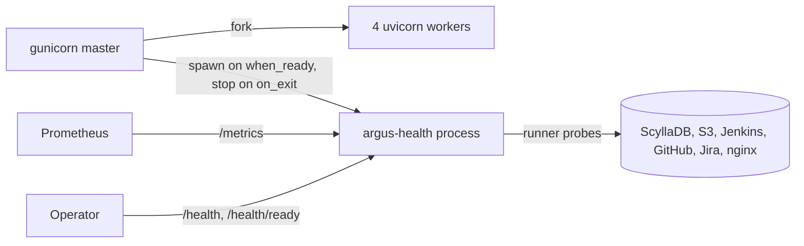

# QATOOLS-425 — Report the health of the Argus dependencies

**Date**: 2026-09-21

## Design drivers

- Four gunicorn workers export through `PROMETHEUS_MULTIPROC_DIR`, which calls no custom collector. The runner needs one process with its own exporter.
- The gunicorn master forks a new worker on every `max_requests` restart. The master must hold no extra thread at a fork.
- The health process has the lifecycle of gunicorn. No new systemd unit and no new supervisord program.
- `qatools-health` needs Python 3.13. The `argus-alm` client keeps its 3.10 floor.
- The backend is synchronous. A check must never block the health loop.
- The ScyllaDB check uses the Argus cluster configuration, not a private connection string.

## Goals

- Run the `qatools-health` runner in one child process that the gunicorn master starts and stops.
- Serve `/health`, `/health/ready` and `/metrics` from that process on a separate internal port, with no authentication.
- Probe ScyllaDB, each S3 bucket in `S3_ALLOWED_BUCKETS`, Jenkins, GitHub, Jira, nginx and the SSH tunnel key lookup.
- Move the web backend to Python 3.13: CI backend jobs, the Dockerfile and the production venv.

## Non-goals

- No gate on a web route. A request still runs while a dependency is down.
- No check of the gunicorn workers. The master restarts a dead worker, and the `argus_exporter` scrape job already fails when the workers stop answering `/metrics`.
- No automatic restart of a dead health process.
- No change to the `/metrics` route of the workers or to the series they export.
- No Grafana dashboard, no alert rule and no scrape job. QATOOLS-426 and `qatools-deployments` own them.
- No change to the `qatools-health` package.

## Design



The `when_ready` hook starts the health process with the `spawn` start method, so the child shares no memory, lock or thread with the master. The master keeps only the process handle. The `on_exit` hook sends SIGTERM and waits `graceful_timeout`. The child exits when its parent process id changes, so a killed master leaves no orphan.

The child removes `PROMETHEUS_MULTIPROC_DIR` from its environment before any import, so its metrics stay in its own registry. It loads `argus_web.yaml`, builds its own `ScyllaCluster` from the same keys the workers read, registers the checks, and runs the runner and a uvicorn server on one asyncio loop.

A request reads `runner.snapshot()` and never starts a probe. Each check runs on its own interval, 300 seconds by default.

| Check | Name | Severity | Probe | Registered when |
|---|---|---|---|---|
| `ScyllaHealthCheck` | `scylla` | critical | `SELECT release_version FROM system.local` at `LOCAL_ONE` through `execute_async` | always |
| `NginxHealthCheck` | `nginx` | critical | `GET http://127.0.0.1/s/<static file>`, served by nginx alone | always |
| `SshKeyLookupHealthCheck` | `ssh_key_lookup` | important | `TunnelService.get_authorized_keys` with a sentinel fingerprint that matches no key | always |
| `S3BucketHealthCheck` | `s3:<bucket>` | important | `HeadBucket` | once per bucket in `S3_ALLOWED_BUCKETS` |
| `JenkinsApiHealthCheck` | `jenkins_api` | important | from the package | `JENKINS_URL` is set |
| `GitHubApiHealthCheck` | `github_api` | important | from the package | `GITHUB_ENABLED` |
| `JiraApiHealthCheck` | `jira_api` | important | from the package | `JIRA_ENABLED` |

The S3 and SSH lookup checks call a synchronous library. They run it through `asyncio.to_thread`, and the library timeouts stay below the check timeout, so an abandoned thread ends on its own.

`ScyllaHealthCheck` reports DEGRADED with the live host count when the query answers and some hosts are down. It reports UNHEALTHY when the query fails or no coordinator answers.

| Condition | Behavior |
|---|---|
| A critical check is UNHEALTHY | `/health/ready` answers 503 |
| Only an important check is UNHEALTHY or DEGRADED | `/health/ready` answers 200 with `"status": "degraded"` |
| No check has run yet | The aggregate reads UNHEALTHY, `/health/ready` answers 503 for at most one check timeout |
| The config has no Jira, GitHub or Jenkins | That check is not registered and has no series |
| The health process dies | Its port stops answering, `up{job="argus_health"}` drops to 0, the workers keep serving |
| `HEALTH_ENABLED` is false | `when_ready` starts nothing |

## Contracts

### Inputs

`argus_web.yaml`, new keys:

```yaml
HEALTH_ENABLED: true
HEALTH_HOST: 0.0.0.0
HEALTH_PORT: 9300
```

Existing keys read: `SCYLLA_*`, `AWS_CLIENT_ID`, `AWS_CLIENT_SECRET`, `S3_ALLOWED_BUCKETS`, `JENKINS_URL`, `JENKINS_USER`, `JENKINS_API_TOKEN`, `GITHUB_ENABLED`, `GITHUB_ACCESS_TOKEN`, `JIRA_ENABLED`, `JIRA_SERVER`, `JIRA_EMAIL`, `JIRA_TOKEN`.

### Outputs

`GET /health` always answers 200 while the process serves:

```json
{
  "service": "argus",
  "version": "0.16.3",
  "status": "degraded",
  "runner_up": true,
  "checks": [
    {"name": "jira_api", "severity": "important", "status": "unhealthy",
     "message": "myself answered 401", "stale": false,
     "last_run_timestamp": 1790000000.0, "last_success_timestamp": 1789990000.0}
  ]
}
```

`GET /health/ready` answers 200 or 503 with `{"status": "healthy" | "degraded" | "unhealthy"}`.

`GET /metrics` exports the `healthcheck_*` families from `qatools-health/README.md`, section "Metrics", with `service="argus"`.

`pyproject.toml`:

```toml
web-backend = [..., "qatools-health ; python_version >= '3.13'"]

[tool.uv.sources]
qatools-health = { path = "qatools-health", editable = true }
```

### Module API

```python
class ScyllaHealthCheck(HealthCheck):
    def __init__(self, session: cassandra.cluster.Session, **policy: Any) -> None: ...

def build_runner(config: dict[str, Any], cluster: ScyllaCluster) -> HealthCheckRunner: ...

def build_app(runner: HealthCheckRunner, registry: CollectorRegistry) -> FastAPI: ...

def serve() -> None: ...
```

`serve()` is the entry point of the child process. `gunicorn.conf.py` calls nothing else.

## Risks

| Risk | Response |
|---|---|
| A library in the backend fails on Python 3.13 | Run the full backend suite on 3.13 in CI before the deploy |
| The `argus-alm` metadata names `qatools-health`, which PyPI does not hold | The marker and the extra keep it out of every client install. Nobody installs `argus-alm[web-backend]` from PyPI |
| The health process adds a fifth ScyllaDB connection pool | One pool of the same size as a worker's, with one query per interval |
| The sentinel lookup diverges from the query `sshd` triggers | The check calls the same service method the route calls |
| Port 9300 is closed in the security group | `qatools-deployments` opens it for the monitoring host with the scrape job |
| The health process dies and nothing restarts it | The scrape job `up` alert fires. The next gunicorn restart starts it again |

## Deferred work

- Gate a feature on a dependency, for example stop the Jira sync while `jira_api` is UNHEALTHY. The runner already returns a subscription for it.
- Move `ScyllaHealthCheck` into `qatools-health` when a second service connects to ScyllaDB.
- Restart a dead health process from the master.

---

Files, internal functions, tests, and line numbers go to `plan.md`. On the
spike path the code diff carries them, and the spec keeps this shape. A spec
near 150 lines, diagrams included, reads in one sitting. Above that, consider
a split and propose it in the spec. This footer stays in every spec.
