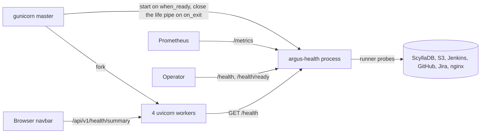

# QATOOLS-425 — Report the health of the Argus dependencies

**Date**: 2026-09-28

## Design drivers

- Four gunicorn workers export through `PROMETHEUS_MULTIPROC_DIR`, which calls no custom collector. The runner needs one process with its own exporter.
- The gunicorn master forks a new worker on every `max_requests` restart. The master must hold no extra thread at a fork.
- The health process has the lifecycle of gunicorn. No new systemd unit and no new supervisord program.
- The cluster open of `scylla-driver` and every `boto3` call are synchronous. A check that calls one must never block the health loop.
- The ScyllaDB check uses the Argus cluster configuration, not a private connection string.
- A user sees a failing dependency in Argus, not only on the Grafana dashboard.

## Decision: a child process of the gunicorn master

The runner runs in one child process that the master starts, not as a task inside the workers.

| Option | Result |
|---|---|
| A task in each worker | Four runners, four probe loops per dependency, and four answers that can differ. The multiprocess exposition drops the runner collector, so `/metrics` carries no `healthcheck_*` series. A `max_requests` restart of a worker resets its results. A slow synchronous route shares the event loop with the probes. |
| A task in one elected worker | Needs a lock between the workers, and the lock moves on every worker restart. The exposition problem stays. |
| A thread in the master | The master forks workers with that thread alive. A lock held by the thread at the fork stays held in the worker. |
| A child process of the master | Selected. One runner and one exporter. A crash in a check stays out of the workers, and a slow route stays out of the probes. |

The cost of the selection is a fifth process with its own ScyllaDB pool, and one more port to open.

## Goals

- Run the `qatools-health` runner in one child process that the gunicorn master starts and stops.
- Serve `/health`, `/health/ready` and `/metrics` from that process on a separate internal port, with no authentication.
- Probe ScyllaDB, each S3 bucket in `S3_ALLOWED_BUCKETS`, Jenkins, GitHub, Jira, nginx and the SSH tunnel key lookup.
- Name each dependency that is not healthy, with its status and the reason, in the `/health` answer.
- Show an icon in the navigation bar to a signed-in user while a dependency is not healthy. The icon names the failing dependencies.
- Update `docs/project/architecture.md` and `AGENTS.md` for the health process.

## Non-goals

- No gate on a web route. A request still runs while a dependency is down.
- No check of the gunicorn workers. When a worker fails to boot, gunicorn halts the master, and `on_exit` stops the health process with it. `/health` then stops answering, and the `argus_health` scrape job reports `up` 0. A worker that dies after boot gets a new one from the master, and the `argus_exporter` scrape job fails when no worker answers.
- No automatic restart of a dead health process.
- No change to the `/metrics` route of the workers or to the series they export.
- No Grafana dashboard, no alert rule and no scrape job. QATOOLS-426 and `qatools-deployments` own them.
- No change to the `qatools-health` package.

## Design


```mermaid
flowchart LR
    M[gunicorn master] -->|fork| W[4 uvicorn workers]
    M -->|start on when_ready, close the life pipe on on_exit| H[argus-health process]
    H -->|runner probes| D[(ScyllaDB, S3, Jenkins, GitHub, Jira, nginx)]
    P[Prometheus] -->|/metrics| H
    O[Operator] -->|/health, /health/ready| H
    W -->|GET /health| H
    B[Browser navbar] -->|/api/v1/health/summary| W
```

The `when_ready` hook starts `[sys.executable, "-m", "argus.backend.service.health"]` through `/bin/sh -c '"$@" &'` in a new session. The shell exits at once, so the health process is not a child of the master. The gunicorn master reaps every child with `waitpid(-1)`, halts on exit status 3 or 4, and can give a reaped process id to a new worker, so the master keeps no process id. It keeps the write end of a life pipe and the read end of a done pipe. The health process stops when the life pipe closes, and it holds the done pipe until it exits. A killed master closes the life pipe too, so it leaves no orphan. Each worker closes both pipes in `post_fork`. The health process is a new interpreter and shares no memory, lock or thread with the master. The master imports no health module. The `on_exit` hook closes the life pipe and waits up to `graceful_timeout` for the done pipe to close. The health process exits by force 20 seconds after a stop, so a hung probe thread cannot keep it alive.

The child removes `PROMETHEUS_MULTIPROC_DIR` from its environment before any import, so its metrics stay in its own registry. It loads `argus_web.yaml`, registers the checks, and runs the runner and a uvicorn server on one asyncio loop. The ScyllaDB checks open a `ScyllaCluster` from the same keys the workers read on their first probe, so a ScyllaDB outage at start gives an UNHEALTHY check, not a dead process.

A request reads `runner.snapshot()` and never starts a probe. Each check runs on its own interval, 300 seconds by default.

| Check | Name | Severity | Probe | Registered when |
|---|---|---|---|---|
| `ScyllaHealthCheck` | `scylla` | critical | `SELECT release_version FROM system.local` at `LOCAL_ONE` through `execute_async` | always |
| `NginxHealthCheck` | `nginx` | important | `GET HEALTH_NGINX_URL`, `http://127.0.0.1/s/argus.png` by default, served by nginx alone | always |
| `SshKeyLookupHealthCheck` | `ssh_key_lookup` | important | `TunnelService.get_authorized_keys` with a well-formed `SHA256:` sentinel fingerprint that matches no key. An empty answer is HEALTHY | always |
| `S3BucketHealthCheck` | `s3:<bucket>` | important | `HeadBucket` | once per bucket in `S3_ALLOWED_BUCKETS` |
| `JenkinsApiHealthCheck` | `jenkins_api` | important | from the package | `JENKINS_URL` is set |
| `GitHubApiHealthCheck` | `github_api` | important | from the package | `GITHUB_ENABLED` |
| `JiraApiHealthCheck` | `jira_api` | important | from the package | `JIRA_ENABLED` |

The S3 check and the cluster open call a synchronous library. They run it through `asyncio.to_thread`, and the library timeouts stay below the check timeout, so an abandoned thread ends on its own. One cluster open runs at a time, and a probe that times out leaves it to the next probe. The SSH lookup awaits the `coodie.aio` read on the health loop.

`NginxHealthCheck` is important, not critical. Some instances serve the static files through gunicorn, and a failed probe there must not make `/health/ready` answer 503.

`ScyllaHealthCheck` reports DEGRADED with the live host count when the query answers and some hosts are down. It counts only the hosts the load balancing policy does not ignore. It reports UNHEALTHY when the query fails or no coordinator answers.

The navigation bar mounts a `HealthIndicator` component for a signed-in user. It reads `/api/v1/health/summary` on load and every five minutes. The route asks the health process for `/health` at `HEALTH_HOST:HEALTH_PORT` with a two-second timeout, and it answers with the aggregate and the checks that are not healthy.

| Condition | Behavior |
|---|---|
| A critical check is UNHEALTHY | `/health/ready` answers 503. The icon is red |
| Only an important check is UNHEALTHY or DEGRADED | `/health/ready` answers 200 with `"status": "degraded"`. The icon is yellow |
| All checks are HEALTHY | The navigation bar shows no icon |
| No check has run yet | The aggregate reads UNHEALTHY, `/health/ready` answers 503 for at most one check timeout. `/health` reports each such check as `pending`. The summary leaves pending checks out of `failing` and out of its status, so a start or a SIGHUP shows no icon |
| The config has no Jira, GitHub or Jenkins | That check is not registered and has no series |
| The health process dies | Its port stops answering, `up{job="argus_health"}` drops to 0, the workers keep serving. The summary reads `unknown`, and the icon is grey |
| `HEALTH_ENABLED` is false or absent | `when_ready` starts nothing. The summary reads `"enabled": false`, and the navigation bar shows no icon |
| A SIGHUP reload | `on_reload` closes the life pipe of the health process and starts a new one at once when `HEALTH_ENABLED` is true, so it reads the edited `HEALTH_*` keys. The master does not wait before it starts the new workers. The new process waits up to 30 seconds for the port, and the old process exits by force 20 seconds after the stop. An error in `on_reload` goes to the gunicorn log, and the reload continues without a health process |
| A check stops probing | Past `stale_after_intervals` it reads at least DEGRADED in `/health`, as in the aggregate, and it appears in the summary |

## Contracts

### Inputs

`argus_web.yaml`, new keys:

```yaml
HEALTH_ENABLED: true
HEALTH_HOST: <private address of the host>
HEALTH_PORT: 9300
HEALTH_NGINX_URL: http://127.0.0.1/s/argus.png
```

An absent `HEALTH_ENABLED` reads false, so a development machine and the Docker image open no port until their config sets it. An absent `HEALTH_HOST` reads `127.0.0.1`. The production config sets the private address that Prometheus scrapes. `0.0.0.0` is an explicit choice, never a default. A worker connects to `HEALTH_HOST`, and to `127.0.0.1` when it is `0.0.0.0`. An absent `HEALTH_NGINX_URL` reads `http://127.0.0.1/s/argus.png`. A config for the Docker image sets `http://127.0.0.1:8000/s/argus.png`, because the nginx of the image listens on port 8000.

Existing keys read: `SCYLLA_*`, `AWS_CLIENT_ID`, `AWS_CLIENT_SECRET`, `S3_ALLOWED_BUCKETS`, `JENKINS_URL`, `JENKINS_USER`, `JENKINS_API_TOKEN`, `GITHUB_ENABLED`, `GITHUB_ACCESS_TOKEN`, `JIRA_ENABLED`, `JIRA_SERVER`, `JIRA_EMAIL`, `JIRA_TOKEN`.

### Outputs

`GET /health` on the health port always answers 200 while the process serves:

```json
{
  "service": "argus",
  "version": "0.16.3",
  "status": "degraded",
  "runner_up": true,
  "checks": [
    {"name": "jira_api", "severity": "important", "status": "unhealthy",
     "message": "myself answered 401", "stale": false,
     "last_run_timestamp": 1790000000.0, "last_success_timestamp": 1789990000.0}
  ]
}
```

A check `status` is `healthy`, `degraded`, `unhealthy`, or `pending` before its first run ends.

`GET /health/ready` answers 200 or 503 with `{"status": "healthy" | "degraded" | "unhealthy"}`.

`GET /metrics` exports the `healthcheck_*` families from `qatools-health/README.md`, section "Metrics", with `service="argus"`.

`GET /api/v1/health/summary` on the workers, behind `api_current_user`:

```json
{"status": "ok", "response": {"enabled": true, "status": "degraded",
  "failing": [{"name": "jira_api", "severity": "important", "status": "unhealthy"}]}}
```

`response.status` is `healthy`, `degraded`, `unhealthy` or `unknown`. The status counts only the checks that are not pending, with the aggregate rule of the runner.

`pyproject.toml`:

```toml
web-backend = [..., "qatools-health ; python_version >= '3.13'"]

[tool.uv.sources]
qatools-health = { path = "qatools-health", editable = true }
```

The marker lets `uv lock` resolve the `>=3.10` floor of the `argus-alm` client. The web backend runs on Python 3.14, so every backend install gets the package.

### Module API

```python
class ScyllaHealthCheck(HealthCheck):
    def __init__(self, database: ArgusDatabase, **policy: Any) -> None: ...

def build_runner(config: dict[str, Any]) -> HealthCheckRunner: ...

def build_app(runner: HealthCheckRunner, registry: CollectorRegistry) -> FastAPI: ...

def main() -> int: ...
```

`python -m argus.backend.service.health <life fd>` calls `main(sys.argv)`, and its return value is the exit status. Without the argument, the process runs until SIGTERM. `gunicorn.conf.py` imports none of these names.

## Risks

| Risk | Response |
|---|---|
| `/health` shows the version, the bucket names and upstream error text with no authentication | The listener binds loopback unless the config names an address |
| The navigation bar shows upstream error text to every signed-in user | The summary sends the name, the severity and the status of a check, and no message. The health process log and `/health` keep the message |
| The `argus-alm` metadata names `qatools-health`, which PyPI does not hold | The marker and the extra keep it out of every client install. Nobody installs `argus-alm[web-backend]` from PyPI |
| The health process adds a fifth ScyllaDB connection pool | One pool of the same size as a worker's, with one query per interval |
| The sentinel lookup diverges from the query `sshd` triggers | The check calls the same service method the route calls |
| Port 9300 is closed in the security group | `qatools-deployments` opens it for the monitoring host with the scrape job |
| The health process dies and nothing restarts it | The scrape job `up` alert fires, and the navigation bar icon turns grey. The next gunicorn restart starts it again |

## Deferred work

- Gate a feature on a dependency, for example stop the Jira sync while `jira_api` is UNHEALTHY. The runner already returns a subscription for it.
- Move `ScyllaHealthCheck` into `qatools-health` when a second service connects to ScyllaDB.
- Restart a dead health process from the master.

---

Files, internal functions, tests, and line numbers go to `plan.md`. On the
spike path the code diff carries them, and the spec keeps this shape. A spec
near 150 lines, diagrams included, reads in one sitting. Above that, consider
a split and propose it in the spec. This footer stays in every spec.
