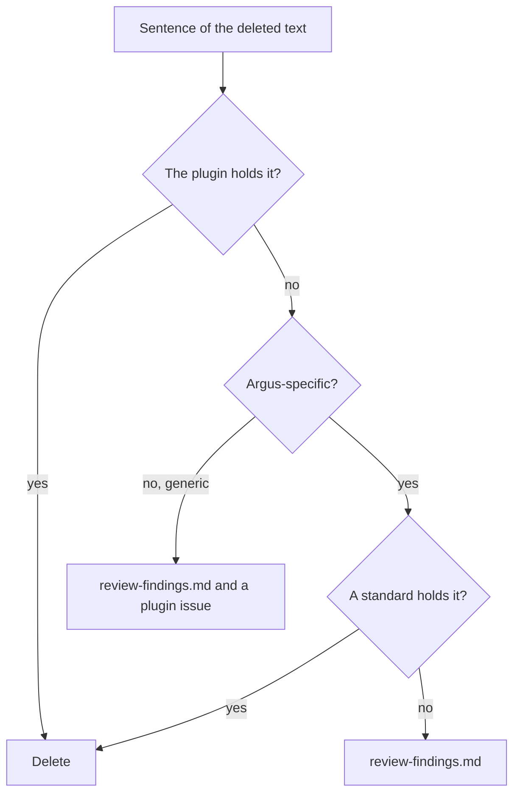

# QATOOLS-464 — Argus consumes the qatools-sdlc plugin

**Date**: 2026-09-21

## Design drivers

- The plugin text is the single source of the flow. Argus keeps no sentence
  that the plugin also holds.
- A rule that only Argus needs lives in a standard under `docs/standards/`,
  where pass 3 of the plugin review policy reads it.
- `/qatools-sdlc:init` is idempotent. The edits it makes to `CLAUDE.md`,
  `tasks/README.md` and `.claude/settings.json` stay as it writes them, so
  a later run changes nothing.
- The pull request body line follows the plugin: `closes <KEY>` or
  `refs <KEY>` as the last line. The plugin review skill checks that line.
- The artifacts of the tasks already under `tasks/` stay as a record.

## Goals

- `.claude/settings.json` declares the `qatools` marketplace and the
  `qatools-sdlc` plugin.
- `CLAUDE.md` carries the plugin section between the plugin markers, and no
  other flow text.
- `docs/standards/development-flow.md`, `docs/standards/REVIEW.md`,
  `tasks/templates/` and `.claude/commands/review-pr.md` are gone.
- A new standard, `docs/standards/global/review-findings.md`, holds the review
  scope and the checks that remove a false report in Argus.
- `README.md`, `docs/INDEX.md`, `AGENTS.md`, `docs/project/roadmap.md` and
  `docs/standards/global/conventions.md` point at the plugin, and name the
  new standard where they named the review policy.
- `docs/standards/global/conventions.md` states the dependency version
  floor, and `docs/project/architecture.md` states that a person files an
  issue from a metric. Both rules come from the deleted flow text.
- This task runs through `/qatools-sdlc:intent`, `/qatools-sdlc:spec` and
  `/qatools-sdlc:plan`.

## Non-goals

- No change to the plugin text. A generic rule that the plugin lacks goes to
  a plugin issue, see Deferred work.
- No change to `tasks/*/` of the earlier tasks, even where they name the
  deleted files.
- No change to the coding standards under `backend/`, `frontend/` and
  `testing/`.
- No second review command next to `/qatools-sdlc:review`.
- No install of the plugin at user scope for other engineers.
- No hook that checks the order of the commits or the body line.

## Design

Four components take part.

The **settings entry** in `.claude/settings.json` names the marketplace and
the plugin. A session in the repository reads it and knows which plugin to
install. The `permissions` key stays as it is.

The **CLAUDE.md section**, between `<!-- qatools-sdlc:begin -->` and
`<!-- qatools-sdlc:end -->`, replaces the `Development Flow` and
`Task Artifacts` sections. It names the skills, the install commands, the key
prefix, the task directory, and the `Commands` section as the verify
sequence. The `Coding Standards & Conventions` and `Commands` sections stay. The
plugin section carries the rule to suggest a standard for a convention that
no standard holds.

The **plugin** holds the flow text, the review policy and the four templates.
The skills read them from the plugin root. Argus deletes its copies.
`tasks/README.md`, written by init, tells a reader where the templates live.

The **standards** hold what only Argus needs. Each sentence of the deleted
review policy that the plugin text does not hold goes to one place:



The Argus-specific security checks of the old pass 2, the Svelte 5 rune
semantics, and the CSS color pair already sit in `backend/api.md`,
`backend/queries.md`, `global/validation.md`, `frontend/components.md` and
`frontend/css.md`. They are deleted with the file. The review scope, the
five generic checks that remove a false report, the migration fallback rule,
and the outcome for a pull request that predates the flow go to
`global/review-findings.md`. Pass 3 of the plugin policy asks whether the
change follows the standards, so a reviewer reaches the new standard from
the plugin.

The **pull request body** ends with `closes <KEY>` or `refs <KEY>`.
`conventions.md` states the rule in the words of the plugin flow text, and
`docs/INDEX.md` describes it the same way.

| Condition | Behavior |
|---|---|
| The `/qatools-sdlc:*` skills are absent in a session | The CLAUDE.md section tells the session to stop and give the user the two install commands |
| `/qatools-sdlc:init` runs again | Every step finds its output in place and changes nothing |
| `docs/standards/` exists when init runs | Init leaves it and `docs/INDEX.md` alone. This task edits them by hand |
| A pull request predates the flow and carries no `tasks/<KEY>/` | Pass 3 records `not applicable — no task spec` and checks the standards only |
| An earlier task artifact names `tasks/templates/` | It stays. The artifact is a record of its date |

## Contracts

### Inputs

The plugin files that init reads and writes into the repository, at plugin
version 1.0.1:

```
${CLAUDE_PLUGIN_ROOT}/skills/init/claude-md-section.md   # {{KEY_PREFIX}} filled with ARGUS
${CLAUDE_PLUGIN_ROOT}/skills/init/tasks-readme.md        # verbatim
```

### Outputs

The settings entry. Every other key in the file stays.

```json
{
  "extraKnownMarketplaces": {
    "qatools": { "source": { "source": "git", "url": "git@github.com:scylladb/qatools.git" } }
  },
  "enabledPlugins": { "qatools-sdlc@qatools": true }
}
```

The `CLAUDE.md` section is the plugin text with `{{KEY_PREFIX}}` set to
`ARGUS`. A later init run replaces the text between the markers whole.

The new standard, its sections:

```markdown
# Review Findings

## Scope
The diff is the review boundary. Up to five findings, the highest confidence first.

## Before you report a finding
1. Read the full context. ...
2. Name a concrete failure. ...
3. Weigh the runtime evidence. ...
4. Treat a repeated pattern as a convention. ...
5. Read the existing comments first. ...
6. Leave migration code alone. ...

## A pull request without a task
Record `not applicable — no task spec` for pass 3 and check the standards only.
```

The pull request rule in `conventions.md`:

```markdown
End the body with `closes <KEY>` when the merge finishes the task, and with
`refs <KEY>` when a later pull request does.
```

### Module API

None.

## Risks

| Risk | Response |
|---|---|
| An engineer has no plugin installed and the session follows no flow | The CLAUDE.md section stops the session and gives the two install commands |
| The plugin changes the CLAUDE.md section text | A rerun of `/qatools-sdlc:init` replaces the text between the markers |
| An open pull request ends with `Fixes ARGUS-<n>` | The review reports it under pass 3. Findings do not block a merge |
| The plugin has no false-report checks, so a review from another repository lacks them | Deferred work names the plugin issue |

## Deferred work

- A plugin issue that proposes the five generic checks of
  `review-findings.md` for the plugin review policy. When the plugin takes
  them, the Argus standard keeps only the Argus-specific lines.
- The same init in the other QA Tools repositories.

---

Files, internal functions, tests, and line numbers go to `plan.md`. On the
spike path the code diff carries them, and the spec keeps this shape. A spec
near 150 lines, diagrams included, reads in one sitting. Above that, consider
a split and propose it in the spec. This footer stays in every spec.
