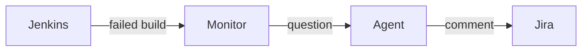

# <KEY> — <short title>

**Date**: <YYYY-MM-DD>

Code and diagrams first. A data shape is a dataclass, a schema, or a type. A
database change is its DDL. A module API is its signature. An external
contract is the request and the response, with the real field names. A flow
or a decision is a Mermaid diagram, except a single linear flow. Prose
carries what no code states: a driver, a non-goal, a risk. Replace every
example below with content.

## Design drivers

What the design must get right that `intent.md` does not name. A driver
comes from the designer: a bound on load or latency, no new index in the
database, a feature planned later that shapes this design. One line each.
The Design section answers each one. Do not restate the intent. `None` when
the intent names every constraint.

## Goals

What this change delivers. One line each.

## Non-goals

What this change leaves alone. One line each. The list is not exhaustive. It
shows what the team drops on purpose. It holds an implementer to the ask,
since an implementer tends to do more than the ask.

## Design

The components that take part, and what each one does.

One Mermaid diagram per flow the change adds or alters. A sequence diagram
for a call chain, a flowchart for a decision. Name components, not functions.
No diagram for a single linear flow.



The decision rules the design adopts, as a flowchart when a decision has more
than two branches. The failure behavior the design adopts, as a table:

| Condition | Behavior |
|---|---|
| The source is down | Skip the poll, log once, retry on the next tick |
| The lookup returns nothing | Answer with the partial result and say so |

## Contracts

### Inputs

Each external source the change reads: the endpoint or the CLI command, and
the fields used, as a code block. `None` when the change reads nothing new.

```
argus run get <run_id>    # fields: status, scylla_version, started_at
```

### Outputs

Each surface another party uses, in the form it takes. A data shape as a
dataclass, a schema, or a type. A database change as its DDL. A generated
file as a short excerpt. A message or an endpoint as the request and the
response, with the real field names. The rules a consumer follows sit next
to the artifact. `None` when the change produces nothing new.

```python
@dataclass(slots=True, frozen=True)
class BuildFailure:
    job: str
    build: int
    stage: str | None
```

```sql
CREATE TABLE build_failure (
    job TEXT NOT NULL,
    build INTEGER NOT NULL,
    stage TEXT,
    PRIMARY KEY (job, build)
);
```

### Module API

Each signature another module calls, as a code block. The whole public API
of a new module. `None` when no other module imports it.

```python
async def triage(failure: BuildFailure, *, client: httpx.AsyncClient) -> Triage: ...
```

## Risks

| Risk | Response |
|---|---|
| | |

## Deferred work

The work planned for later that shapes the design now: a module boundary
that must hold, an API that must grow, a data source that will arrive. The
design leaves room for it and does not build it.

---

Files, internal functions, tests, and line numbers go to `plan.md`. On the
spike path the code diff carries them, and the spec keeps this shape. A spec
near 150 lines, diagrams included, reads in one sitting. Above that, consider
a split and propose it in the spec. This footer stays in every spec.
